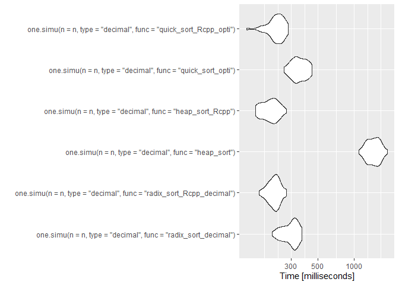
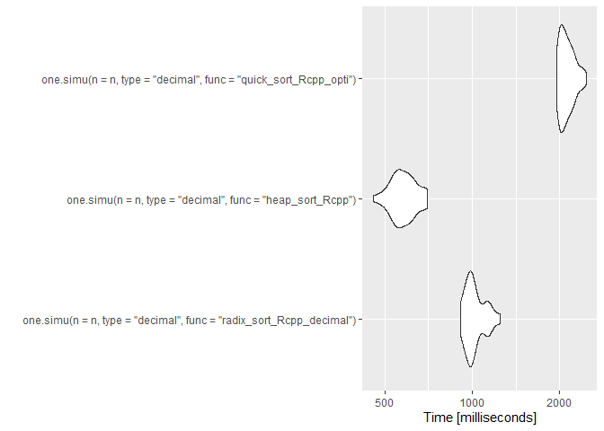
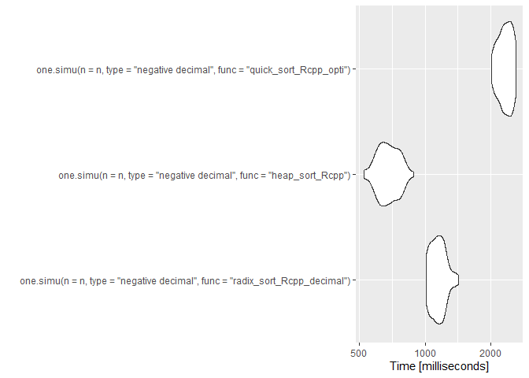
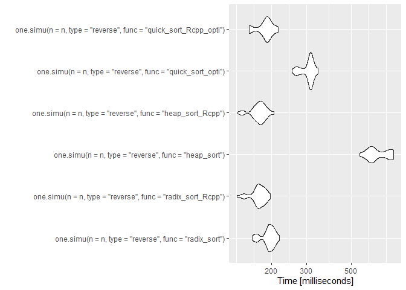
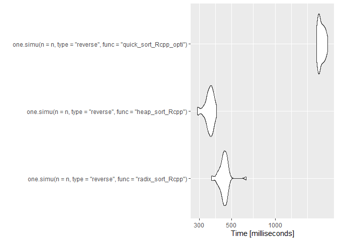
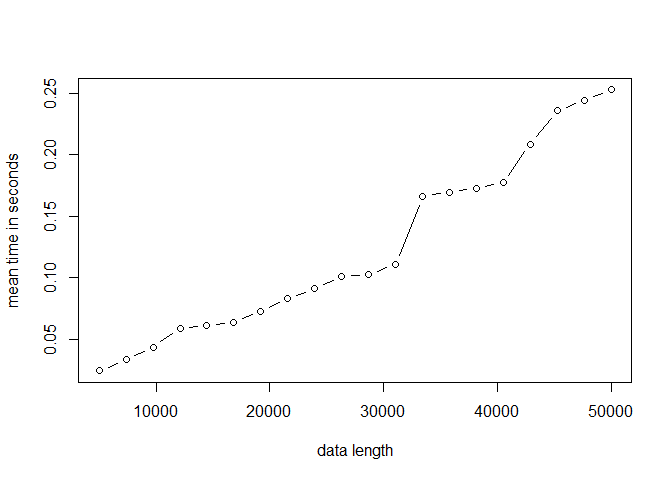

# Projet M2 Algorithmique

### Jawad Boulahfa, Kylliann De Santiago, Romain Brulé

#### M2 Data Science: Santé, Assurance, Finance

#### Université d’Evry Val d’Essonne

### 14 décembre 2020

> [Introduction](#intro)

> [Algorithmes de tri à n fixé](#n)

> [Microbenchmark](#micro)

> [Complexité](#complexity)

<a id="intro"></a>

## Introduction

Le package R `RadixSort` a été réalisé dans le cadre du projet
d’algorithmique. Le but de ce dernier est d’une part de coder
l’algorithme de tri radix sort à la fois en R et en Rcpp afin de
comparer les performances des deux méthodes et d’autre part de comparer
les performances de cet algorithme avec d’autres algorithmes de tri. Ce
fichier récapitule les simulations effectuées au cours de ce projet et
les conclusions qui en ont été tirées.

### Installation du package

Avant de commencer, on nettoie l’environnement de travail.

``` r
rm(list = ls())
```

Il faut avoir préalablement installé le package `devtools`. Ensuite, il
suffit de retirer le symbole “\#” et d’exécuter la ligne correspondante
pour installer le package RadixSort. On peut alors l’utiliser comme
n’importe quel autre package R via la commande: `library(RadixSort)`.

``` r
#devtools::install_github("Jawad-Boulahfa/RadixSort")
library(RadixSort)
```

On charge aussi le package M2algorithmique (qu’il faut également avoir
préalablement installé) dont on aura besoin lorsque l’on utilisera le
heap sort.

``` r
#devtools::install_github("vrunge/M2algorithmique")
library(M2algorithmique)
```

### Premier essai

On effectue un premier essai en triant un vecteur de taille 10 issu d’un
tirage aléatoire (avec remise) d’entiers compris entre 1 et 10.

``` r
n <- 10
#V <- floor(runif(n, min=0, max=n))
V <- sample.int(n, replace = TRUE)
```

Vecteur à trier.

``` r
V
```

    ##  [1]  5 10  7 10  8  1  6  2  8  8

Radix sort avec la fonction codée en R.

``` r
radix_sort(V)
```

    ##  [1]  1  2  5  6  7  8  8  8 10 10

Radix sort avec la fonction codée en Rcpp.

``` r
radix_sort_Rcpp(V)
```

    ##  [1]  1  2  5  6  7  8  8  8 10 10

Heap sort avec la fonction codée en R.

``` r
heap_sort(V)
```

    ##  [1]  1  2  5  6  7  8  8  8 10 10

Heap sort avec la fonction codée en Rcpp.

``` r
heap_sort_Rcpp(V)
```

    ##  [1]  1  2  5  6  7  8  8  8 10 10

Quick sort avec la fonction codée en R.

``` r
quick_sort_opti(V)
```

    ##  [1]  1  2  5  6  7  8  8  8 10 10

Quick sort avec la fonction codée en Rcpp.

``` r
quick_sort_Rcpp_opti(V)
```

    ##  [1]  1  2  5  6  7  8  8  8 10 10

<a id="n"></a>

## Algorithmes de tri à n fixé

Le but de cette partie est de comparer les temps d’exécution de
plusieurs algorithmes de tri à \(n\) fixé. Plus précisément, on va
comparer les performances du radix sort avec le heap sort et le quick
sort.

### Une simulation

Tout d’abord, on définit une fonction qui nous permettra d’exécuter une
simulation (i.e. un tri de vecteur) selon l’algorithme choisi et la
valeur de \(n\) fixée par l’utilisateur. On introduit également un
paramètre “type” qui permet de choisir la forme du vecteur à trier.

``` r
one.simu <- function(n, type = "integer", func = "radix_sort", precision = 3)
{
  ### Choix du type de vecteur à trier ###
  
  # Tire n nombres entiers aléatoires compris entre 1 et n
  if(type == "integer")
  {
    V <- sample.int(n, replace = TRUE) # Cas moyen: entiers aléatoires compris entre 1 et $n$.
  }
  
  # Tire n nombres entiers aléatoires compris entre -n et n (sauf 0)
  if(type == "negative integer")
  {
    sign <- runif(n,min=0,max=1)
    sign[sign >= 0.5] <- 1
    sign[sign < 0.5] <- -1
    V <- sample.int(n, replace = TRUE)*sign
  }
  
  # Tire n nombres décimaux aléatoires compris entre 0 et n
  if(type == "decimal")
  {
    V <- round(runif(n, min=0, max = n), precision)
  }
  
  # Tire n nombres décimaux aléatoires compris entre -n et n
  if(type == "negative decimal")
  {
    sign <- runif(n,min=0,max=1)
    sign[sign>=0.5] <- 1
    sign[sign<0.5] <- -1
    V <- round(runif(n, min=0, max = n)*sign, precision) 
  }
  
  # Construit un vecteur contenant tout les nombres entiers de n à 1 (ordre décroissant)
  if(type == "reverse")
  {
    V <- n:1 
  }
  
  ### Choix de l'algorithme de tri ###
  
  # Ici, on calcule le temps d'exécution de l'algorithme de tri choisi
  
  if(func == "radix_sort"){t <- system.time(radix_sort(V))[[1]]}
  if(func == "radix_sort_Rcpp"){t <- system.time(radix_sort_Rcpp(V))[[1]]}
  
  if(func == "radix_sort_decimal"){t <- system.time(radix_sort_decimal(V))[[1]]}
  if(func == "radix_sort_Rcpp_decimal"){t <- system.time(radix_sort_Rcpp_decimal(V))[[1]]}
  
  if(func == "heap_sort"){t <- system.time(heap_sort(V))[[1]]} 
  if(func == "heap_sort_Rcpp"){t <- system.time(heap_sort_Rcpp(V))[[1]]}
  
  if(func == "quick_sort_opti"){t <- system.time(quick_sort_opti(V))[[1]]}
  if(func == "quick_sort_Rcpp_opti"){t <- system.time(quick_sort_Rcpp_opti(V))[[1]]}


  return(t)
}
```

``` r
n <- 10^4
```

On fait une première simulation pour chacun des algorithmes avec
\(n = 10^{4}\) afin d’illustrer le fonctionnement de `one.simu`. Par
défaut, le vecteur a trier est issu d’un tirage aléatoire avec (remise)
d’entiers compris entre 1 et \(n\).

``` r
one.simu(n = n, func = "radix_sort")
```

    ## [1] 0.03

``` r
one.simu(n = n, func = "radix_sort_Rcpp")
```

    ## [1] 0

``` r
one.simu(n = n, func = "heap_sort")
```

    ## [1] 0.47

``` r
one.simu(n = n, func = "heap_sort_Rcpp")
```

    ## [1] 0.02

``` r
one.simu(n = n, func = "quick_sort_opti")
```

    ## [1] 0.11

``` r
one.simu(n = n, func = "quick_sort_Rcpp_opti")
```

    ## [1] 0.01

### Simulations avec des nombres entiers naturels

On commence par s’intéresser aux performances de chaque algorithme dans
le cas où les valeurs du vecteurs à trier sont issus d’un tirage
aléatoire (avec remise) d’entiers compris entre 1 et \(n\).

``` r
# Valeur de n (taille du vecteur à trier)
n <- 10^4

# Nombre de fois où on répète l'algorithme sur un vecteur de taille n
nbSimus <- 10

# Temps d'exécutions
t1 <- 0
t2 <- 0
t3 <- 0
t4 <- 0
t5 <- 0
t6 <- 0

# Simulations
for(i in 1:nbSimus){t1 <- t1 + one.simu(n = n, type = "integer", func = "radix_sort")}
for(i in 1:nbSimus){t2 <- t2 + one.simu(n = n, type = "integer", func = "radix_sort_Rcpp")}
for(i in 1:nbSimus){t3 <- t3 + one.simu(n = n, type = "integer", func = "heap_sort")}
for(i in 1:nbSimus){t4 <- t4 + one.simu(n = n, type = "integer", func = "heap_sort_Rcpp")}
for(i in 1:nbSimus){t5 <- t5 + one.simu(n = n, type = "integer", func = "quick_sort_opti")}
for(i in 1:nbSimus){t6 <- t6 + one.simu(n = n, type = "integer", func = "quick_sort_Rcpp_opti")}
```

On affiche les temps d’exécution pour effectuer 10 simulations.

``` r
t1 # temps d'exécution du radix sort en R
```

    ## [1] 0.2

``` r
t2 # temps d'exécution du radix sort en Rcpp
```

    ## [1] 0.01

``` r
t3 # temps d'exécution du heap sort en R
```

    ## [1] 4.79

``` r
t4 # temps d'exécution du heap sort en Rcpp
```

    ## [1] 0.02

``` r
t5 # temps d'exécution du quick sort en R
```

    ## [1] 0.99

``` r
t6 # temps d'exécution du quick sort en Rcpp
```

    ## [1] 0.14

Comparaison des temps d’exécution.

``` r
t1/t2 # radix sort gain R -> Rcpp
```

    ## [1] 20

``` r
t3/t4 # heap sort gain R -> Rcpp
```

    ## [1] 239.5

``` r
t5/t6 # quick sort gain R -> Rcpp
```

    ## [1] 7.071429

Lorqu’on utilise le radix sort codé en R au lieu de celui codé en Rcpp,
on multiplie par environ 20 le temps d’exécution. Lorqu’on utilise le
heap sort codé en R au lieu de celui codé en Rcpp, on multiplie par
environ 239.5 le temps d’exécution. Lorqu’on utilise le quick sort codé
en R au lieu de celui codé en Rcpp, on multiplie par environ 99 le temps
d’exécution. Ainsi, le code est Rcpp est toujours bien plus rapide que
celui en R.

``` r
t1/t3 # comparaison radix sort en R et heap sort en R
```

    ## [1] 0.04175365

``` r
t1/t5 # comparaison radix sort en R et quick sort en R
```

    ## [1] 0.2020202

``` r
t3/t5 # comparaison heap sort en R et quick sort en R
```

    ## [1] 4.838384

``` r
t2/t4 # comparaison radix sort en Rcpp et heap sort en Rcpp
```

    ## [1] 0.5

``` r
t2/t6 # comparaison radix sort en Rcpp et quick sort en Rcpp
```

    ## [1] 0.07142857

``` r
t4/t6 # comparaison heap sort en Rcpp et quick sort en Rcpp
```

    ## [1] 0.1428571

### Simulations avec des nombres entiers relatifs

On s’intéresse ici aux performances de chaque algorithme dans le cas où
les valeurs du vecteurs à trier sont issus d’un tirage aléatoire (avec
remise) d’entiers compris entre \(-n\) et \(n\).

``` r
# Valeur de n (taille du vecteur à trier)
n <- 10^4

# Nombre de fois où on répète l'algorithme sur un vecteur de taille n
nbSimus <- 10

# Temps d'exécutions
t1 <- 0
t2 <- 0
t3 <- 0
t4 <- 0
t5 <- 0
t6 <- 0

# Simulations
for(i in 1:nbSimus){t1 <- t1 + one.simu(n = n, type = "negative integer",
                                        func = "radix_sort")}
for(i in 1:nbSimus){t2 <- t2 + one.simu(n = n, type = "negative integer",
                                        func = "radix_sort_Rcpp")}
for(i in 1:nbSimus){t3 <- t3 + one.simu(n = n, type = "negative integer",
                                        func = "heap_sort")}
for(i in 1:nbSimus){t4 <- t4 + one.simu(n = n, type = "negative integer",
                                        func = "heap_sort_Rcpp")}
for(i in 1:nbSimus){t5 <- t5 + one.simu(n = n, type = "negative integer",
                                        func = "quick_sort_opti")}
for(i in 1:nbSimus){t6 <- t6 + one.simu(n = n, type = "negative integer",
                                        func = "quick_sort_Rcpp_opti")}
```

On affiche les temps d’exécution pour effectuer 10 simulations.

``` r
t1 # temps d'exécution du radix sort en R
```

    ## [1] 0.24

``` r
t2 # temps d'exécution du radix sort en Rcpp
```

    ## [1] 0.04

``` r
t3 # temps d'exécution du heap sort en R
```

    ## [1] 9.04

``` r
t4 # temps d'exécution du heap sort en Rcpp
```

    ## [1] 0

``` r
t5 # temps d'exécution du quick sort en R
```

    ## [1] 1.38

``` r
t6 # temps d'exécution du quick sort en Rcpp
```

    ## [1] 0.17

Comparaison des temps d’exécution.

``` r
t1/t2 # radix sort gain R -> Rcpp
```

    ## [1] 6

``` r
t3/t4 # heap sort gain R -> Rcpp
```

    ## [1] Inf

``` r
t5/t6 # quick sort gain R -> Rcpp
```

    ## [1] 8.117647

Lorqu’on utilise le radix sort codé en R au lieu de celui codé en Rcpp,
on multiplie par environ 6 le temps d’exécution. Lorqu’on utilise le
heap sort codé en R au lieu de celui codé en Rcpp, on multiplie par
environ  le temps d’exécution. Lorqu’on utilise le quick sort codé en R
au lieu de celui codé en Rcpp, on multiplie par environ 34.5 le temps
d’exécution. Ainsi, le code est Rcpp est toujours bien plus rapide que
celui en R.

``` r
t1/t3 # comparaison radix sort en R et heap sort en R
```

    ## [1] 0.02654867

``` r
t1/t5 # comparaison radix sort en R et quick sort en R
```

    ## [1] 0.173913

``` r
t3/t5 # comparaison heap sort en R et quick sort en R
```

    ## [1] 6.550725

``` r
t2/t4 # comparaison radix sort en Rcpp et heap sort en Rcpp
```

    ## [1] Inf

``` r
t2/t6 # comparaison radix sort en Rcpp et quick sort en Rcpp
```

    ## [1] 0.2352941

``` r
t4/t6 # comparaison heap sort en Rcpp et quick sort en Rcpp
```

    ## [1] 0

### Simulations avec des nombres décimaux non signés

On commence par s’intéresser aux performances de chaque algorithme dans
le cas où les valeurs du vecteurs à trier sont issus d’un tirage
aléatoire (avec remise) d’entiers compris entre 1 et \(n\).

``` r
# Valeur de n (taille du vecteur à trier)
n <- 10^4

# Nombre de fois où on répète l'algorithme sur un vecteur de taille n
nbSimus <- 10

# Temps d'exécutions
t1 <- 0
t2 <- 0
t3 <- 0
t4 <- 0
t5 <- 0
t6 <- 0

# Simulations
for(i in 1:nbSimus){t1 <- t1 + one.simu(n = n, type = "decimal", func = "radix_sort_decimal")}
for(i in 1:nbSimus){t2 <- t2 + one.simu(n = n, type = "decimal", func = "radix_sort_Rcpp_decimal")}
for(i in 1:nbSimus){t3 <- t3 + one.simu(n = n, type = "decimal", func = "heap_sort")}
for(i in 1:nbSimus){t4 <- t4 + one.simu(n = n, type = "decimal", func = "heap_sort_Rcpp")}
for(i in 1:nbSimus){t5 <- t5 + one.simu(n = n, type = "decimal", func = "quick_sort_opti")}
for(i in 1:nbSimus){t6 <- t6 + one.simu(n = n, type = "decimal", func = "quick_sort_Rcpp_opti")}
```

On affiche les temps d’exécution pour effectuer 10 simulations.

``` r
t1 # temps d'exécution du radix sort en R
```

    ## [1] 1.19

``` r
t2 # temps d'exécution du radix sort en Rcpp
```

    ## [1] 0.05

``` r
t3 # temps d'exécution du heap sort en R
```

    ## [1] 9.06

``` r
t4 # temps d'exécution du heap sort en Rcpp
```

    ## [1] 0.04

``` r
t5 # temps d'exécution du quick sort en R
```

    ## [1] 1.41

``` r
t6 # temps d'exécution du quick sort en Rcpp
```

    ## [1] 0.23

Comparaison des temps d’exécution.

``` r
t1/t2 # radix sort gain R -> Rcpp
```

    ## [1] 23.8

``` r
t3/t4 # heap sort gain R -> Rcpp
```

    ## [1] 226.5

``` r
t5/t6 # quick sort gain R -> Rcpp
```

    ## [1] 6.130435

Lorqu’on utilise le radix sort codé en R au lieu de celui codé en Rcpp,
on multiplie par environ 23.8 le temps d’exécution. Lorqu’on utilise le
heap sort codé en R au lieu de celui codé en Rcpp, on multiplie par
environ 226.5 le temps d’exécution. Lorqu’on utilise le quick sort codé
en R au lieu de celui codé en Rcpp, on multiplie par environ 28.2 le
temps d’exécution. Ainsi, le code est Rcpp est toujours bien plus rapide
que celui en R.

``` r
t1/t3 # comparaison radix sort en R et heap sort en R
```

    ## [1] 0.1313466

``` r
t1/t5 # comparaison radix sort en R et quick sort en R
```

    ## [1] 0.8439716

``` r
t3/t5 # comparaison heap sort en R et quick sort en R
```

    ## [1] 6.425532

``` r
t2/t4 # comparaison radix sort en Rcpp et heap sort en Rcpp
```

    ## [1] 1.25

``` r
t2/t6 # comparaison radix sort en Rcpp et quick sort en Rcpp
```

    ## [1] 0.2173913

``` r
t4/t6 # comparaison heap sort en Rcpp et quick sort en Rcpp
```

    ## [1] 0.173913

### Simulations avec des nombres décimaux signés

On s’intéresse ici aux performances de chaque algorithme dans le cas où
les valeurs du vecteurs à trier sont issus d’un tirage aléatoire (avec
remise) d’entiers compris entre \(-n\) et \(n\).

``` r
# Valeur de n (taille du vecteur à trier)
n <- 10^4

# Nombre de fois où on répète l'algorithme sur un vecteur de taille n
nbSimus <- 10

# Temps d'exécutions
t1 <- 0
t2 <- 0
t3 <- 0
t4 <- 0
t5 <- 0
t6 <- 0

# Simulations
for(i in 1:nbSimus){t1 <- t1 + one.simu(n = n, type = "negative decimal",
                                        func = "radix_sort_decimal")}
for(i in 1:nbSimus){t2 <- t2 + one.simu(n = n, type = "negative decimal",
                                        func = "radix_sort_Rcpp_decimal")}
for(i in 1:nbSimus){t3 <- t3 + one.simu(n = n, type = "negative decimal",
                                        func = "heap_sort")}
for(i in 1:nbSimus){t4 <- t4 + one.simu(n = n, type = "negative decimal",
                                        func = "heap_sort_Rcpp")}
for(i in 1:nbSimus){t5 <- t5 + one.simu(n = n, type = "negative decimal",
                                        func = "quick_sort_opti")}
for(i in 1:nbSimus){t6 <- t6 + one.simu(n = n, type = "negative decimal",
                                        func = "quick_sort_Rcpp_opti")}
```

On affiche les temps d’exécution pour effectuer 10 simulations.

``` r
t1 # temps d'exécution du radix sort en R
```

    ## [1] 1.17

``` r
t2 # temps d'exécution du radix sort en Rcpp
```

    ## [1] 0.09

``` r
t3 # temps d'exécution du heap sort en R
```

    ## [1] 8.43

``` r
t4 # temps d'exécution du heap sort en Rcpp
```

    ## [1] 0.01

``` r
t5 # temps d'exécution du quick sort en R
```

    ## [1] 1.37

``` r
t6 # temps d'exécution du quick sort en Rcpp
```

    ## [1] 0.15

Comparaison des temps d’exécution.

``` r
t1/t2 # radix sort gain R -> Rcpp
```

    ## [1] 13

``` r
t3/t4 # heap sort gain R -> Rcpp
```

    ## [1] 843

``` r
t5/t6 # quick sort gain R -> Rcpp
```

    ## [1] 9.133333

Lorqu’on utilise le radix sort codé en R au lieu de celui codé en Rcpp,
on multiplie par environ 13 le temps d’exécution. Lorqu’on utilise le
heap sort codé en R au lieu de celui codé en Rcpp, on multiplie par
environ 843 le temps d’exécution. Lorqu’on utilise le quick sort codé en
R au lieu de celui codé en Rcpp, on multiplie par environ 15.22 le temps
d’exécution. Ainsi, le code est Rcpp est toujours bien plus rapide que
celui en R.

``` r
t1/t3 # comparaison radix sort en R et heap sort en R
```

    ## [1] 0.13879

``` r
t1/t5 # comparaison radix sort en R et quick sort en R
```

    ## [1] 0.8540146

``` r
t3/t5 # comparaison heap sort en R et quick sort en R
```

    ## [1] 6.153285

``` r
t2/t4 # comparaison radix sort en Rcpp et heap sort en Rcpp
```

    ## [1] 9

``` r
t2/t6 # comparaison radix sort en Rcpp et quick sort en Rcpp
```

    ## [1] 0.6

``` r
t4/t6 # comparaison heap sort en Rcpp et quick sort en Rcpp
```

    ## [1] 0.06666667

### Simulations dans le cas où le vecteur est trié dans l’ordre décroissant

On s’intéresse ici aux performances de chaque algorithme dans le cas où
les valeurs du vecteurs à trier sont rangées dans l’ordre décroissant.

``` r
# Valeur de n (taille du vecteur à trier)
n <- 10^4

# Nombre de fois où on répète l'algorithme sur un vecteur de taille n
nbSimus <- 10

# Temps d'exécutions
t1 <- 0
t2 <- 0
t3 <- 0
t4 <- 0
t5 <- 0
t6 <- 0

# Simulations
for(i in 1:nbSimus){t1 <- t1 + one.simu(n = n, type = "reverse", func = "radix_sort")}
for(i in 1:nbSimus){t2 <- t2 + one.simu(n = n, type = "reverse", func = "radix_sort_Rcpp")}
for(i in 1:nbSimus){t3 <- t3 + one.simu(n = n, type = "reverse", func = "heap_sort")}
for(i in 1:nbSimus){t4 <- t4 + one.simu(n = n, type = "reverse", func = "heap_sort_Rcpp")}
for(i in 1:nbSimus){t5 <- t5 + one.simu(n = n, type = "reverse", func = "quick_sort_opti")}
for(i in 1:nbSimus){t6 <- t6 + one.simu(n = n, type = "reverse", func = "quick_sort_Rcpp_opti")}
```

On affiche les temps d’exécution pour effectuer 10 simulations.

``` r
t1 # temps d'exécution du radix sort en R
```

    ## [1] 0.26

``` r
t2 # temps d'exécution du radix sort en Rcpp
```

    ## [1] 0.04

``` r
t3 # temps d'exécution du heap sort en R
```

    ## [1] 3.77

``` r
t4 # temps d'exécution du heap sort en Rcpp
```

    ## [1] 0.02

``` r
t5 # temps d'exécution du quick sort en R
```

    ## [1] 1.4

``` r
t6 # temps d'exécution du quick sort en Rcpp
```

    ## [1] 0.19

Comparaison des temps d’exécution.

``` r
t1/t2 # radix sort gain R -> Rcpp
```

    ## [1] 6.5

``` r
t3/t4 # heap sort gain R -> Rcpp
```

    ## [1] 188.5

``` r
t5/t6 # quick sort gain R -> Rcpp
```

    ## [1] 7.368421

Lorqu’on utilise le radix sort codé en R au lieu de celui codé en Rcpp,
on multiplie par environ 6.5 le temps d’exécution. Lorqu’on utilise le
heap sort codé en R au lieu de celui codé en Rcpp, on multiplie par
environ 188.5 le temps d’exécution. Lorqu’on utilise le quick sort codé
en R au lieu de celui codé en Rcpp, on multiplie par environ 35 le temps
d’exécution. Ainsi, le code est Rcpp est toujours bien plus rapide que
celui en R.

``` r
t1/t3 # comparaison radix sort en R et heap sort en R
```

    ## [1] 0.06896552

``` r
t1/t5 # comparaison radix sort en R et quick sort en R
```

    ## [1] 0.1857143

``` r
t3/t5 # comparaison heap sort en R et quick sort en R
```

    ## [1] 2.692857

``` r
t2/t4 # comparaison radix sort en Rcpp et heap sort en Rcpp
```

    ## [1] 2

``` r
t2/t6 # comparaison radix sort en Rcpp et quick sort en Rcpp
```

    ## [1] 0.2105263

``` r
t4/t6 # comparaison heap sort en Rcpp et quick sort en Rcpp
```

    ## [1] 0.1052632

<a id="micro"></a>

## Microbenchmark

``` r
library(microbenchmark)
library(ggplot2)
```

### Comparaisons avec des entiers naturels

On commence par comparer les 3 algorithmes en même temps. Sur cet
exemple, avec un vecteur de taille \(10^4\), on remarque que le radix
sort en R est le moins bon des 3. Le radix sort en Rcpp semble meilleur
que le heap sort en Rcpp, mais pour confirmer cela, nous allons faire un
second essai avec un vecteur plus grand.

``` r
n <- 10^4
res <- microbenchmark(one.simu(n = n, type = "integer", func = "radix_sort"),
                      one.simu(n = n, type = "integer", func = "radix_sort_Rcpp"),
                      one.simu(n = n, type = "integer", func = "heap_sort"),
                      one.simu(n = n, type = "integer", func = "heap_sort_Rcpp"),
                      one.simu(n = n, type = "integer", func = "quick_sort_opti"),
                      one.simu(n = n, type = "integer", func = "quick_sort_Rcpp_opti"),
                      times = 50)
autoplot(res)
```

    ## Coordinate system already present. Adding new coordinate system, which will replace the existing one.

<!-- -->

``` r
print(res)
```

    ## Unit: milliseconds
    ##                                                              expr      min
    ##            one.simu(n = n, type = "integer", func = "radix_sort")  66.6112
    ##       one.simu(n = n, type = "integer", func = "radix_sort_Rcpp")  51.8449
    ##             one.simu(n = n, type = "integer", func = "heap_sort") 493.9443
    ##        one.simu(n = n, type = "integer", func = "heap_sort_Rcpp")  50.8321
    ##       one.simu(n = n, type = "integer", func = "quick_sort_opti") 122.7648
    ##  one.simu(n = n, type = "integer", func = "quick_sort_Rcpp_opti")  66.2770
    ##        lq      mean    median       uq      max neval  cld
    ##   89.1339  98.08377  99.06115 108.5081 120.7748    50  b  
    ##   67.0685  75.66781  76.41525  82.5333 101.4021    50 a   
    ##  554.6774 609.75589 606.51230 673.3824 741.9699    50    d
    ##   67.0215  75.48068  76.18530  82.8029 103.3775    50 a   
    ##  155.8283 173.78568 176.50425 187.4414 270.5120    50   c 
    ##   80.4393  89.73797  91.63625  96.0985 120.2480    50 ab

On fait maintenant un second essai avec une plus grande taille pour le
vecteur à trier (\(n = 10^5\) ici). On remarque le radix sort est
meilleur que le heap sort. Ce qui est cohérent avec les résultats
précédents (partie `Simulations dans le "cas moyen"`).

``` r
n <- 10^5
res <- microbenchmark(one.simu(n = n, type = "integer", func = "radix_sort_Rcpp"),
                      one.simu(n = n, type = "integer", func = "heap_sort_Rcpp"),
                      one.simu(n = n, type = "integer", func = "quick_sort_Rcpp_opti"),
                      times = 50)
autoplot(res)
```

    ## Coordinate system already present. Adding new coordinate system, which will replace the existing one.

<!-- -->

``` r
print(res)
```

    ## Unit: milliseconds
    ##                                                              expr      min
    ##       one.simu(n = n, type = "integer", func = "radix_sort_Rcpp") 174.8760
    ##        one.simu(n = n, type = "integer", func = "heap_sort_Rcpp") 164.1797
    ##  one.simu(n = n, type = "integer", func = "quick_sort_Rcpp_opti") 293.7552
    ##        lq     mean   median       uq      max neval cld
    ##  195.6146 209.4688 210.9173 222.2166 250.3757    50  a 
    ##  207.1735 214.2009 216.4449 225.0440 236.7306    50  a 
    ##  326.8506 351.9278 354.5542 366.2660 563.9717    50   b

### Comparaisons avec des entiers relatifs

On commence par comparer les 3 algorithmes en même temps. Sur cet
exemple, avec un vecteur de taille \(10^4\), on remarque que le radix
sort en R est le moins bon des 3. Le radix sort en Rcpp semble meilleur
que le heap sort en Rcpp, mais pour confirmer cela, nous allons faire un
second essai avec un vecteur plus grand.

``` r
n <- 10^4
res <- microbenchmark(one.simu(n = n, type = "negative integer", func = "radix_sort"),
                      one.simu(n = n, type = "negative integer", func = "radix_sort_Rcpp"),
                      one.simu(n = n, type = "negative integer", func = "heap_sort"),
                      one.simu(n = n, type = "negative integer", func = "heap_sort_Rcpp"),
                      one.simu(n = n, type = "negative integer", func = "quick_sort_opti"),
                      one.simu(n = n, type = "negative integer", func = "quick_sort_Rcpp_opti"),
                      times = 50)
autoplot(res)
```

    ## Coordinate system already present. Adding new coordinate system, which will replace the existing one.

<!-- -->

``` r
print(res)
```

    ## Unit: milliseconds
    ##                                                                       expr
    ##            one.simu(n = n, type = "negative integer", func = "radix_sort")
    ##       one.simu(n = n, type = "negative integer", func = "radix_sort_Rcpp")
    ##             one.simu(n = n, type = "negative integer", func = "heap_sort")
    ##        one.simu(n = n, type = "negative integer", func = "heap_sort_Rcpp")
    ##       one.simu(n = n, type = "negative integer", func = "quick_sort_opti")
    ##  one.simu(n = n, type = "negative integer", func = "quick_sort_Rcpp_opti")
    ##       min        lq      mean    median        uq       max neval cld
    ##  153.1488  180.9789  200.2096  201.9688  216.0059  244.6172    50 a  
    ##  151.4792  171.3482  181.6123  184.4282  192.0370  210.1824    50 a  
    ##  925.2472 1291.4853 1440.4343 1420.0264 1547.8058 1958.3405    50   c
    ##  132.9915  170.7211  182.8835  184.6642  193.0370  223.2896    50 a  
    ##  204.7313  270.1321  287.7749  290.9084  309.9346  338.9672    50  b 
    ##  138.1985  185.0857  198.3754  203.0453  213.1796  237.9647    50 a

On fait maintenant un second essai avec une plus grande taille pour le
vecteur à trier (\(n = 10^6\) ici). On remarque le radix sort est
meilleur que le heap sort. Ce qui est cohérent avec les résultats
précédents (partie `Simulations dans le "cas moyen"`).

``` r
n <- 10^5
res <- microbenchmark(one.simu(n = n, type = "negative integer", func = "radix_sort_Rcpp"),
                      one.simu(n = n, type = "negative integer", func = "heap_sort_Rcpp"),
                      one.simu(n = n, type = "negative integer", func = "quick_sort_Rcpp_opti"),
                      times = 50)
autoplot(res)
```

    ## Coordinate system already present. Adding new coordinate system, which will replace the existing one.

<!-- -->

``` r
print(res)
```

    ## Unit: milliseconds
    ##                                                                       expr
    ##       one.simu(n = n, type = "negative integer", func = "radix_sort_Rcpp")
    ##        one.simu(n = n, type = "negative integer", func = "heap_sort_Rcpp")
    ##  one.simu(n = n, type = "negative integer", func = "quick_sort_Rcpp_opti")
    ##       min       lq     mean   median       uq      max neval cld
    ##  182.0886 214.0880 230.6447 235.4717 247.6776 267.7366    50  a 
    ##  170.0258 221.7706 232.4186 232.8476 245.8142 278.7264    50  a 
    ##  306.0753 354.2966 370.1601 374.2828 384.7900 425.6265    50   b

### Comparaisons avec des nombres décimaux non signés

On commence par comparer les 3 algorithmes en même temps. Sur cet
exemple, avec un vecteur de taille \(10^4\), on remarque que le radix
sort en R est le moins bon des 3. Le radix sort en Rcpp semble meilleur
que le heap sort en Rcpp, mais pour confirmer cela, nous allons faire un
second essai avec un vecteur plus grand.

``` r
n <- 10^4
res <- microbenchmark(one.simu(n = n, type = "decimal", func = "radix_sort_decimal"),
                      one.simu(n = n, type = "decimal", func = "radix_sort_Rcpp_decimal"),
                      one.simu(n = n, type = "decimal", func = "heap_sort"),
                      one.simu(n = n, type = "decimal", func = "heap_sort_Rcpp"),
                      one.simu(n = n, type = "decimal", func = "quick_sort_opti"),
                      one.simu(n = n, type = "decimal", func = "quick_sort_Rcpp_opti"),
                      times = 50)
autoplot(res)
```

    ## Coordinate system already present. Adding new coordinate system, which will replace the existing one.

<!-- -->

``` r
print(res)
```

    ## Unit: milliseconds
    ##                                                                 expr       min
    ##       one.simu(n = n, type = "decimal", func = "radix_sort_decimal")  222.5454
    ##  one.simu(n = n, type = "decimal", func = "radix_sort_Rcpp_decimal")  129.4752
    ##                one.simu(n = n, type = "decimal", func = "heap_sort") 1030.7057
    ##           one.simu(n = n, type = "decimal", func = "heap_sort_Rcpp")  121.9967
    ##          one.simu(n = n, type = "decimal", func = "quick_sort_opti")  242.0972
    ##     one.simu(n = n, type = "decimal", func = "quick_sort_Rcpp_opti")  149.8414
    ##         lq      mean    median        uq       max neval cld
    ##   272.8628  292.5287  294.0770  310.1938  354.6057    50  b 
    ##   174.3409  189.2358  192.0250  203.4713  235.9207    50 a  
    ##  1231.3263 1318.9461 1299.8994 1408.8852 1525.7368    50   c
    ##   175.3499  186.9781  185.0748  198.6041  230.7984    50 a  
    ##   287.5023  307.9071  310.0124  331.2976  366.9035    50  b 
    ##   181.2848  199.7617  203.6866  218.2829  255.7121    50 a

On fait maintenant un second essai avec une plus grande taille pour le
vecteur à trier (\(n = 10^5\) ici). On remarque le radix sort est
meilleur que le heap sort. Ce qui est cohérent avec les résultats
précédents (partie `Simulations dans le "cas moyen"`).

``` r
n <- 10^5
res <- microbenchmark(one.simu(n = n, type = "decimal", func = "radix_sort_Rcpp_decimal"),
                      one.simu(n = n, type = "decimal", func = "heap_sort_Rcpp"),
                      one.simu(n = n, type = "decimal", func = "quick_sort_Rcpp_opti"),
                      times = 50)
autoplot(res)
```

    ## Coordinate system already present. Adding new coordinate system, which will replace the existing one.

<!-- -->

``` r
print(res)
```

    ## Unit: milliseconds
    ##                                                                 expr      min
    ##  one.simu(n = n, type = "decimal", func = "radix_sort_Rcpp_decimal") 227.3377
    ##           one.simu(n = n, type = "decimal", func = "heap_sort_Rcpp") 171.0036
    ##     one.simu(n = n, type = "decimal", func = "quick_sort_Rcpp_opti") 297.2844
    ##        lq     mean   median       uq      max neval cld
    ##  253.6646 273.9187 273.4871 286.8456 350.8970    50  b 
    ##  205.0187 220.0178 222.3657 235.7292 268.7632    50 a  
    ##  348.0885 380.3193 386.4045 407.1961 447.0710    50   c

### Comparaisons avec des nombres décimaux signés

On commence par comparer les 3 algorithmes en même temps. Sur cet
exemple, avec un vecteur de taille \(10^4\), on remarque que le radix
sort en R est le moins bon des 3. Le radix sort en Rcpp semble meilleur
que le heap sort en Rcpp, mais pour confirmer cela, nous allons faire un
second essai avec un vecteur plus grand.

``` r
n <- 10^4
res <- microbenchmark(one.simu(n = n, type = "negative decimal", func = "radix_sort_decimal"),
                      one.simu(n = n, type = "negative decimal", func = "radix_sort_Rcpp_decimal"),
                      one.simu(n = n, type = "negative decimal", func = "heap_sort"),
                      one.simu(n = n, type = "negative decimal", func = "heap_sort_Rcpp"),
                      one.simu(n = n, type = "negative decimal", func = "quick_sort_opti"),
                      one.simu(n = n, type = "negative decimal", func = "quick_sort_Rcpp_opti"),
                      times = 50)
autoplot(res)
```

    ## Coordinate system already present. Adding new coordinate system, which will replace the existing one.

<!-- -->

``` r
print(res)
```

    ## Unit: milliseconds
    ##                                                                          expr
    ##       one.simu(n = n, type = "negative decimal", func = "radix_sort_decimal")
    ##  one.simu(n = n, type = "negative decimal", func = "radix_sort_Rcpp_decimal")
    ##                one.simu(n = n, type = "negative decimal", func = "heap_sort")
    ##           one.simu(n = n, type = "negative decimal", func = "heap_sort_Rcpp")
    ##          one.simu(n = n, type = "negative decimal", func = "quick_sort_opti")
    ##     one.simu(n = n, type = "negative decimal", func = "quick_sort_Rcpp_opti")
    ##       min        lq      mean    median        uq       max neval  cld
    ##  202.1859  251.3363  272.3684  277.1983  293.4915  330.8813    50  b  
    ##  147.5217  179.3554  194.3643  192.3014  216.8387  239.4120    50 a   
    ##  902.3456 1247.6738 1341.1356 1335.8655 1435.9900 1601.5974    50    d
    ##  125.0976  170.3040  184.9287  190.6345  197.8581  231.8206    50 a   
    ##  241.2469  288.0331  310.7440  311.7309  330.8225  377.5157    50   c 
    ##  129.0584  174.0806  194.3866  199.3721  212.0111  247.8416    50 a

On fait maintenant un second essai avec une plus grande taille pour le
vecteur à trier (\(n = 10^6\) ici). On remarque le radix sort est
meilleur que le heap sort. Ce qui est cohérent avec les résultats
précédents (partie `Simulations dans le "cas moyen"`).

``` r
n <- 10^5
res <- microbenchmark(one.simu(n = n, type = "negative decimal", func = "radix_sort_Rcpp_decimal"),
                      one.simu(n = n, type = "negative decimal", func = "heap_sort_Rcpp"),
                      one.simu(n = n, type = "negative decimal", func = "quick_sort_Rcpp_opti"),
                      times = 50)
autoplot(res)
```

    ## Coordinate system already present. Adding new coordinate system, which will replace the existing one.

<!-- -->

``` r
print(res)
```

    ## Unit: milliseconds
    ##                                                                          expr
    ##  one.simu(n = n, type = "negative decimal", func = "radix_sort_Rcpp_decimal")
    ##           one.simu(n = n, type = "negative decimal", func = "heap_sort_Rcpp")
    ##     one.simu(n = n, type = "negative decimal", func = "quick_sort_Rcpp_opti")
    ##       min       lq     mean   median       uq      max neval cld
    ##  197.1839 261.0563 278.2735 277.8525 300.1547 329.5169    50  b 
    ##  166.5159 209.7259 228.8680 233.4707 247.5985 272.1159    50 a  
    ##  313.0838 353.9893 380.0220 384.1799 402.8931 447.9841    50   c

### Comparaison dans le cas où le vecteur est trié dans l’ordre décroissant

On commence par comparer les 3 algorithmes en même temps. Sur cet
exemple, avec un vecteur de taille \(10^4\), on remarque que le radix
sort en R est une fois encore le plus lent.

Le heap sort en Rcpp semble meilleur que le radix sort en Rcpp, mais
pour confirmer cela, nous allons faire un second essai avec un vecteur
plus grand.

``` r
n <- 10^4
res <- microbenchmark(one.simu(n = n, type = "reverse", func = "radix_sort"),
                      one.simu(n = n, type = "reverse", func = "radix_sort_Rcpp"),
                      one.simu(n = n, type = "reverse", func = "heap_sort"),
                      one.simu(n = n, type = "reverse", func = "heap_sort_Rcpp"),
                      one.simu(n = n, type = "reverse", func = "quick_sort_opti"),
                      one.simu(n = n, type = "reverse", func = "quick_sort_Rcpp_opti"),
                      times = 50)
autoplot(res)
```

    ## Coordinate system already present. Adding new coordinate system, which will replace the existing one.

<!-- -->

``` r
print(res)
```

    ## Unit: milliseconds
    ##                                                              expr      min
    ##            one.simu(n = n, type = "reverse", func = "radix_sort") 157.1377
    ##       one.simu(n = n, type = "reverse", func = "radix_sort_Rcpp") 145.7311
    ##             one.simu(n = n, type = "reverse", func = "heap_sort") 498.7328
    ##        one.simu(n = n, type = "reverse", func = "heap_sort_Rcpp") 121.3139
    ##       one.simu(n = n, type = "reverse", func = "quick_sort_opti") 279.6249
    ##  one.simu(n = n, type = "reverse", func = "quick_sort_Rcpp_opti") 141.0412
    ##        lq     mean   median       uq      max neval  cld
    ##  199.0524 211.1041 214.7503 226.3096 248.5524    50  b  
    ##  178.7636 192.9728 193.6334 208.6592 243.2625    50 ab  
    ##  628.6976 709.6405 697.6038 786.7755 989.8986    50    d
    ##  170.5787 181.9596 183.6660 191.6545 222.5356    50 a   
    ##  302.3623 327.7444 330.4542 344.0089 385.0575    50   c 
    ##  183.1387 199.4376 201.8496 215.5214 250.0213    50 ab

On fait maintenant un second essai avec une plus grande taille pour le
vecteur à trier (\(n = 10^6\) ici). On remarque le radix sort est
meilleur que le heap sort ici. Ainsi, le heap sort est légèrement
meilleur que le radix sort seulement sur de plus petites tailles de
données.

``` r
n <- 10^5
res <- microbenchmark(one.simu(n = n, type = "reverse", func = "radix_sort_Rcpp"),
                      one.simu(n = n, type = "reverse", func = "heap_sort_Rcpp"),
                      one.simu(n = n, type = "reverse", func = "quick_sort_Rcpp_opti"),
                      times = 50)
autoplot(res)
```

    ## Coordinate system already present. Adding new coordinate system, which will replace the existing one.

<!-- -->

``` r
print(res)
```

    ## Unit: milliseconds
    ##                                                              expr      min
    ##       one.simu(n = n, type = "reverse", func = "radix_sort_Rcpp") 143.7417
    ##        one.simu(n = n, type = "reverse", func = "heap_sort_Rcpp") 130.5852
    ##  one.simu(n = n, type = "reverse", func = "quick_sort_Rcpp_opti") 267.9685
    ##        lq     mean   median       uq      max neval cld
    ##  170.7320 190.0432 196.4853 208.2798 234.0263    50  a 
    ##  169.2514 183.5685 187.3186 196.3643 225.1270    50  a 
    ##  317.7657 328.2349 332.6553 341.5765 394.1071    50   b

<a id="complexity"></a>

## Complexité

Le but de cette partie est d’évaluer la complexité des deux versions du
radix sort (celle pour les entiers, et celle qui marche également avec
les décimaux), du heap sort et du quick sort.

### Radix sort en R

On lance \(nbRep = 100\) fois l’algorithme radix sort pour chaque valeur
du vecteur `vector_n` de taille \(nbSimus = 20\). On affiche le graphe
du temps d’exécution moyen en fonction de la taille des données.

``` r
nbSimus <- 10
vector_n <- seq(from = 5000, to = 50000, length.out = nbSimus)
nbRep <- 100
res_radix <- data.frame(matrix(0, nbSimus, nbRep + 1))
colnames(res_radix) <- c("n", paste0("Rep",1:nbRep))

j <- 1
for(i in vector_n)
{
  res_radix[j,] <- c(i, replicate(nbRep, one.simu(i, func = "radix_sort")))  
  #print(j)
  j <- j + 1
}

res <- rowMeans(res_radix[,-1])
plot(vector_n, res, type = 'b', xlab = "data length", ylab = "mean time in seconds")
```

<!-- -->

``` r
#lm(res ~ vector_n)
```

### Radix sort en Rcpp

En Rcpp, on constate qu’on gagne énormément de temps par rapport au code
R. Cependant, on n’a plus du tout la tendance “linéaire” de la courbe.

``` r
nbSimus <- 10
vector_n <- seq(from = 5000, to = 50000, length.out = nbSimus)
nbRep <- 100
res_radix_rcpp <- data.frame(matrix(0, nbSimus, nbRep + 1))
colnames(res_radix_rcpp) <- c("n", paste0("Rep",1:nbRep))

j <- 1
for(i in vector_n)
{
  res_radix_rcpp[j,] <- c(i, replicate(nbRep, one.simu(i, func = "radix_sort_Rcpp")))  
  #print(j)
  j <- j + 1
}

res <- rowMeans(res_radix_rcpp[,-1])
plot(vector_n, res, type = 'b', xlab = "data length", ylab = "mean time in seconds")
```

<!-- -->

### Radix sort en R (version nombres décimaux)

En Rcpp, on constate qu’on gagne énormément de temps par rapport au code
R. Cependant, on n’a plus du tout la tendance “linéaire” de la courbe.

``` r
nbSimus <- 10
vector_n <- seq(from = 5000, to = 50000, length.out = nbSimus)
nbRep <- 100
res_radix_rcpp <- data.frame(matrix(0, nbSimus, nbRep + 1))
colnames(res_radix_rcpp) <- c("n", paste0("Rep",1:nbRep))

j <- 1
for(i in vector_n)
{
  res_radix_rcpp[j,] <- c(i, replicate(nbRep, one.simu(i, func = "radix_sort_decimal")))  
  #print(j)
  j <- j + 1
}

res <- rowMeans(res_radix_rcpp[,-1])
plot(vector_n, res, type = 'b', xlab = "data length", ylab = "mean time in seconds")
```

<!-- -->

### Radix sort en R (version nombres décimaux)

En Rcpp, on constate qu’on gagne énormément de temps par rapport au code
R. Cependant, on n’a plus du tout la tendance “linéaire” de la courbe.

``` r
nbSimus <- 10
vector_n <- seq(from = 5000, to = 50000, length.out = nbSimus)
nbRep <- 100
res_radix_rcpp <- data.frame(matrix(0, nbSimus, nbRep + 1))
colnames(res_radix_rcpp) <- c("n", paste0("Rep",1:nbRep))

j <- 1
for(i in vector_n)
{
  res_radix_rcpp[j,] <- c(i, replicate(nbRep, one.simu(i, func = "radix_sort_Rcpp_decimal")))  
  #print(j)
  j <- j + 1
}

res <- rowMeans(res_radix_rcpp[,-1])
plot(vector_n, res, type = 'b', xlab = "data length", ylab = "mean time in seconds")
```

<!-- -->

### Heap sort en Rcpp

Généralement le heap sort en Rcpp est plus lent que le radix sort en
Rcpp ce qui est cohérent avec les résultats précédents (partie
`Comparaison entre le radix sort en Rcpp et le heap sort en Rcpp ("cas
moyen")`).

``` r
nbSimus <- 10
vector_n <- seq(from = 5000, to = 50000, length.out = nbSimus)
nbRep <- 100
res_heap_sort_rcpp <- data.frame(matrix(0, nbSimus, nbRep + 1))
colnames(res_heap_sort_rcpp) <- c("n", paste0("Rep",1:nbRep))

j <- 1
for(i in vector_n)
{
  res_heap_sort_rcpp[j,] <- c(i, replicate(nbRep, one.simu(i, func = "heap_sort_Rcpp")))  
  #print(j)
  j <- j + 1
}

res <- rowMeans(res_heap_sort_rcpp[,-1])
plot(vector_n, res, type = 'b', xlab = "data length", ylab = "mean time in seconds")
```

<!-- -->

Plus le nombre d’éléments à stocker est grand, plus la différence entre
le heap sort et le radix sort se fait grande.

### Quick sort en Rcpp

Généralement le heap sort en Rcpp est plus lent que le radix sort en
Rcpp ce qui est cohérent avec les résultats précédents (partie
`Comparaison entre le radix sort en Rcpp et le heap sort en Rcpp ("cas
moyen")`).

``` r
nbSimus <- 10
vector_n <- seq(from = 5000, to = 50000, length.out = nbSimus)
nbRep <- 100
res_quick_sort_rcpp <- data.frame(matrix(0, nbSimus, nbRep + 1))
colnames(res_quick_sort_rcpp) <- c("n", paste0("Rep",1:nbRep))

j <- 1
for(i in vector_n)
{
  res_quick_sort_rcpp[j,] <- c(i, replicate(nbRep, one.simu(i, func = "quick_sort_Rcpp_opti")))  
  #print(j)
  j <- j + 1
}

res <- rowMeans(res_quick_sort_rcpp[,-1])
plot(vector_n, res, type = 'b', xlab = "data length", ylab = "mean time in seconds")
```

<!-- -->
