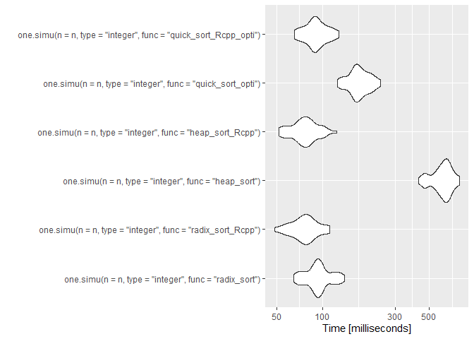
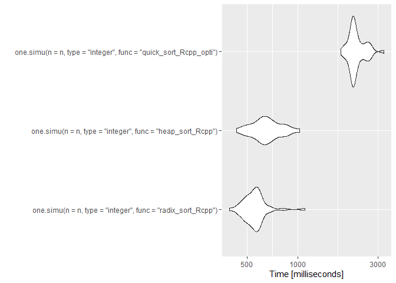
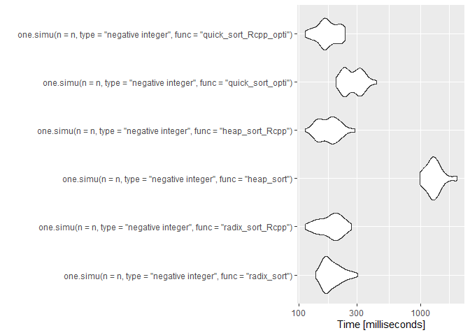
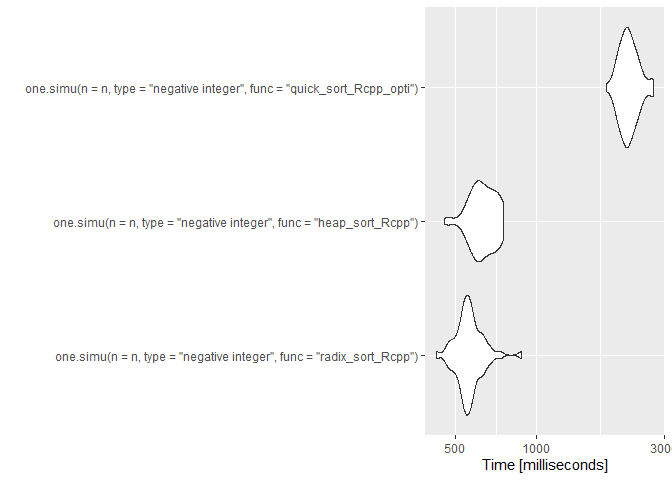

# Projet M2 Algorithmique

### Jawad Boulahfa, Kylliann De Santiago, Romain Brulé

#### M2 Data Science: Santé, Assurance, Finance

#### Université d’Evry Val d’Essonne

### 9 janvier 2021

> [Introduction](#intro)

> [Algorithmes de tri à n fixé](#n)

> [Microbenchmark](#micro)

> [Complexité](#complexity)

<a id="intro"></a>

## Introduction

Le package R `RadixSort` a été réalisé dans le cadre du projet
d’algorithmique. Le but de ce dernier est d’une part de coder
l’algorithme de tri radix sort à la fois en R et en Rcpp afin de
comparer les performances des deux méthodes et d’autre part de comparer
les performances de cet algorithme avec d’autres algorithmes de tri. Ce
fichier récapitule les simulations effectuées au cours de ce projet et
les conclusions qui en ont été tirées.

### Installation du package

Avant de commencer, on nettoie l’environnement de travail.

``` r
rm(list = ls())
```

Il faut avoir préalablement installé le package `devtools`. Ensuite, il
suffit de retirer le symbole “\#” et d’exécuter la ligne correspondante
pour installer le package RadixSort. On peut alors l’utiliser comme
n’importe quel autre package R via la commande: `library(RadixSort)`.

``` r
#devtools::install_github("Jawad-Boulahfa/RadixSort")
library(RadixSort)
```

On charge aussi le package M2algorithmique (qu’il faut également avoir
préalablement installé) dont on aura besoin lorsque l’on utilisera le
heap sort.

``` r
#devtools::install_github("vrunge/M2algorithmique")
library(M2algorithmique)
```

### Premier essai

On effectue un premier essai en triant un vecteur de taille 10 issu d’un
tirage aléatoire (avec remise) d’entiers compris entre 1 et 10.

``` r
n <- 10
#V <- floor(runif(n, min=0, max=n))
V <- sample.int(n, replace = TRUE)
```

Vecteur à trier.

``` r
V
```

    ##  [1] 6 1 8 4 1 2 5 2 7 5

Radix sort avec la fonction codée en R.

``` r
radix_sort(V)
```

    ##  [1] 1 1 2 2 4 5 5 6 7 8

Radix sort avec la fonction codée en Rcpp.

``` r
radix_sort_Rcpp(V)
```

    ##  [1] 1 1 2 2 4 5 5 6 7 8

Heap sort avec la fonction codée en R.

``` r
heap_sort(V)
```

    ##  [1] 1 1 2 2 4 5 5 6 7 8

Heap sort avec la fonction codée en Rcpp.

``` r
heap_sort_Rcpp(V)
```

    ##  [1] 1 1 2 2 4 5 5 6 7 8

Quick sort avec la fonction codée en R.

``` r
quick_sort_opti(V)
```

    ##  [1] 1 1 2 2 4 5 5 6 7 8

Quick sort avec la fonction codée en Rcpp.

``` r
quick_sort_Rcpp_opti(V)
```

    ##  [1] 1 1 2 2 4 5 5 6 7 8

<a id="n"></a>

## Algorithmes de tri à n fixé

Le but de cette partie est de comparer les temps d’exécution de
plusieurs algorithmes de tri à \(n\) fixé. Plus précisément, on va
comparer les performances du radix sort avec le heap sort et le quick
sort.

### Une simulation

Tout d’abord, on définit une fonction qui nous permettra d’exécuter une
simulation (i.e. un tri de vecteur) selon l’algorithme de tri choisi et
la taille \(n\) du vecteur fixée par l’utilisateur. On introduit
également un paramètre “type” qui permet de choisir la forme du vecteur
à trier.

``` r
one.simu <- function(n, type = "integer", func = "radix_sort", precision = 5)
{
  ### Choix du type de vecteur à trier ###
  
  # Tire n nombres entiers aléatoires compris entre 1 et n
  if(type == "integer")
  {
    V <- sample.int(n, replace = TRUE) # Cas moyen: entiers aléatoires compris entre 1 et $n$.
  }
  
  # Tire n nombres entiers aléatoires compris entre -n et n (sauf 0)
  if(type == "negative integer")
  {
    sign <- runif(n,min=0,max=1)
    sign[sign >= 0.5] <- 1
    sign[sign < 0.5] <- -1
    V <- sample.int(n, replace = TRUE)*sign
  }
  
  # Tire n nombres décimaux aléatoires compris entre 0 et n
  if(type == "decimal")
  {
    V <- round(runif(n, min=0, max = n), precision)
  }
  
  # Tire n nombres décimaux aléatoires compris entre -n et n
  if(type == "negative decimal")
  {
    sign <- runif(n,min=0,max=1)
    sign[sign>=0.5] <- 1
    sign[sign<0.5] <- -1
    V <- round(runif(n, min=0, max = n)*sign, precision) 
  }
  
  # Construit un vecteur contenant tout les nombres entiers de n à 1 (ordre décroissant)
  if(type == "reverse")
  {
    V <- n:1 
  }
  
  ### Choix de l'algorithme de tri ###
  
  # Ici, on calcule le temps d'exécution de l'algorithme de tri choisi
  
  if(func == "radix_sort"){t <- system.time(radix_sort(V))[[1]]}
  if(func == "radix_sort_Rcpp"){t <- system.time(radix_sort_Rcpp(V))[[1]]}
  
  if(func == "radix_sort_decimal"){t <- system.time(radix_sort_decimal(V))[[1]]}
  if(func == "radix_sort_Rcpp_decimal"){t <- system.time(radix_sort_Rcpp_decimal(V))[[1]]}
  
  if(func == "heap_sort"){t <- system.time(heap_sort(V))[[1]]} 
  if(func == "heap_sort_Rcpp"){t <- system.time(heap_sort_Rcpp(V))[[1]]}
  
  if(func == "quick_sort_opti"){t <- system.time(quick_sort_opti(V))[[1]]}
  if(func == "quick_sort_Rcpp_opti"){t <- system.time(quick_sort_Rcpp_opti(V))[[1]]}


  return(t)
}
```

``` r
n <- 10^4
```

On fait une première simulation pour chacun des algorithmes avec
\(n = 10^{4}\) afin d’illustrer le fonctionnement de `one.simu`. Par
défaut, le vecteur a trier est issu d’un tirage aléatoire (avec remise)
d’entiers compris entre 1 et \(n\).

``` r
one.simu(n = n, func = "radix_sort")
```

    ## [1] 0.03

``` r
one.simu(n = n, func = "radix_sort_Rcpp")
```

    ## [1] 0

``` r
one.simu(n = n, func = "heap_sort")
```

    ## [1] 0.47

``` r
one.simu(n = n, func = "heap_sort_Rcpp")
```

    ## [1] 0

``` r
one.simu(n = n, func = "quick_sort_opti")
```

    ## [1] 0.11

``` r
one.simu(n = n, func = "quick_sort_Rcpp_opti")
```

    ## [1] 0.02

On conclut que les algorithmes les plus rapides sont le radix sort
(version Rcpp) et le heap sort (version Rcpp) sur ce premier essai. Le
plus lent est le heap sort (version R). On peut également noter un gain
de temps considérable entre le heap sort (version R) et le heap sort
(version Rcpp). Dans tout les cas, le code en Rcpp est toujours plus
rapide que le code en R.

### Simulations avec des nombres entiers naturels

On commence par s’intéresser aux performances de chaque algorithme dans
le cas où les valeurs du vecteurs à trier sont issus d’un tirage
aléatoire (avec remise) d’entiers compris entre 1 et \(n\).

``` r
# Valeur de n (taille du vecteur à trier)
n <- 10^4

# Nombre de fois où on répète l'algorithme sur un vecteur de taille n
nbSimus <- 10

# Temps d'exécutions
t1 <- 0
t2 <- 0
t3 <- 0
t4 <- 0
t5 <- 0
t6 <- 0

# Simulations
for(i in 1:nbSimus){t1 <- t1 + one.simu(n = n, type = "integer", func = "radix_sort")}
for(i in 1:nbSimus){t2 <- t2 + one.simu(n = n, type = "integer", func = "radix_sort_Rcpp")}
for(i in 1:nbSimus){t3 <- t3 + one.simu(n = n, type = "integer", func = "heap_sort")}
for(i in 1:nbSimus){t4 <- t4 + one.simu(n = n, type = "integer", func = "heap_sort_Rcpp")}
for(i in 1:nbSimus){t5 <- t5 + one.simu(n = n, type = "integer", func = "quick_sort_opti")}
for(i in 1:nbSimus){t6 <- t6 + one.simu(n = n, type = "integer", func = "quick_sort_Rcpp_opti")}
```

On affiche les temps d’exécution pour effectuer 10 simulations.

``` r
t1 # temps d'exécution du radix sort en R
```

    ## [1] 0.24

``` r
t2 # temps d'exécution du radix sort en Rcpp
```

    ## [1] 0.04

``` r
t3 # temps d'exécution du heap sort en R
```

    ## [1] 4.92

``` r
t4 # temps d'exécution du heap sort en Rcpp
```

    ## [1] 0.01

``` r
t5 # temps d'exécution du quick sort en R
```

    ## [1] 1.11

``` r
t6 # temps d'exécution du quick sort en Rcpp
```

    ## [1] 0.12

On remarque que heap sort (version R) est à nouveau le plus lent de
tous. Cependant, l’algorithme le plus rapide est le radix sort (version
Rcpp) suivi du heap sort (version Rcpp) alors que sur notre premier
essai, ces deux algorithmes avaient la même performance. Concernant le
quick sort, ce dernier est assez lent comparé aux autres que ce soit en
R ou en Rcpp (0.12 secondes pour la version Rcpp). Ainsi, effectuer
davantage de simulations nous a permis de mieux comparer les
algorithmes.

Calcul du gain en passant de R à Rcpp.

``` r
t1/t2 # radix sort gain R -> Rcpp
```

    ## [1] 6

``` r
t3/t4 # heap sort gain R -> Rcpp
```

    ## [1] 492

``` r
t5/t6 # quick sort gain R -> Rcpp
```

    ## [1] 9.25

Le code est Rcpp est toujours bien plus rapide que celui en R. Par
exemple, le radix sort en Rcpp est 6 fois plus rapide qu’en R.

Comparaison des temps d’exécution en R.

``` r
t1/t3 # comparaison radix sort en R et heap sort en R
```

    ## [1] 0.04878049

``` r
t1/t5 # comparaison radix sort en R et quick sort en R
```

    ## [1] 0.2162162

``` r
t3/t5 # comparaison heap sort en R et quick sort en R
```

    ## [1] 4.432432

En R, le radix sort est plus rapide que le heap sort et le quick sort.
Enfin, le quick sort est environ 4.43 fois plus rapide que le heap sort.

Comparaison des temps d’exécution en Rcpp.

``` r
t2/t4 # comparaison radix sort en Rcpp et heap sort en Rcpp
```

    ## [1] 4

``` r
t2/t6 # comparaison radix sort en Rcpp et quick sort en Rcpp
```

    ## [1] 0.3333333

``` r
t4/t6 # comparaison heap sort en Rcpp et quick sort en Rcpp
```

    ## [1] 0.08333333

En Rcpp, c’est clairement le radix sort qui permet les meilleurs gains
de temps.

### Simulations avec des nombres entiers relatifs

On s’intéresse ici aux performances de chaque algorithme dans le cas où
les valeurs du vecteurs à trier sont issus d’un tirage aléatoire (avec
remise) d’entiers compris entre \(-n\) et \(n\).

``` r
# Valeur de n (taille du vecteur à trier)
n <- 10^4

# Nombre de fois où on répète l'algorithme sur un vecteur de taille n
nbSimus <- 10

# Temps d'exécutions
t1 <- 0
t2 <- 0
t3 <- 0
t4 <- 0
t5 <- 0
t6 <- 0

# Simulations
for(i in 1:nbSimus){t1 <- t1 + one.simu(n = n, type = "negative integer",
                                        func = "radix_sort")}
for(i in 1:nbSimus){t2 <- t2 + one.simu(n = n, type = "negative integer",
                                        func = "radix_sort_Rcpp")}
for(i in 1:nbSimus){t3 <- t3 + one.simu(n = n, type = "negative integer",
                                        func = "heap_sort")}
for(i in 1:nbSimus){t4 <- t4 + one.simu(n = n, type = "negative integer",
                                        func = "heap_sort_Rcpp")}
for(i in 1:nbSimus){t5 <- t5 + one.simu(n = n, type = "negative integer",
                                        func = "quick_sort_opti")}
for(i in 1:nbSimus){t6 <- t6 + one.simu(n = n, type = "negative integer",
                                        func = "quick_sort_Rcpp_opti")}
```

On affiche les temps d’exécution pour effectuer 10 simulations.

``` r
t1 # temps d'exécution du radix sort en R
```

    ## [1] 0.23

``` r
t2 # temps d'exécution du radix sort en Rcpp
```

    ## [1] 0.02

``` r
t3 # temps d'exécution du heap sort en R
```

    ## [1] 8.06

``` r
t4 # temps d'exécution du heap sort en Rcpp
```

    ## [1] 0.04

``` r
t5 # temps d'exécution du quick sort en R
```

    ## [1] 0.99

``` r
t6 # temps d'exécution du quick sort en Rcpp
```

    ## [1] 0.13

On peut noter ici la grande efficacité du heap sort (version Rcpp) sur
ces données. Le radix sort (version Rcpp) est également très performant.

Calcul du gain en passant de R à Rcpp.

``` r
t1/t2 # radix sort gain R -> Rcpp
```

    ## [1] 11.5

``` r
t3/t4 # heap sort gain R -> Rcpp
```

    ## [1] 201.5

``` r
t5/t6 # quick sort gain R -> Rcpp
```

    ## [1] 7.615385

Comparaison des temps d’exécution en R.

``` r
t1/t3 # comparaison radix sort en R et heap sort en R
```

    ## [1] 0.02853598

``` r
t1/t5 # comparaison radix sort en R et quick sort en R
```

    ## [1] 0.2323232

``` r
t3/t5 # comparaison heap sort en R et quick sort en R
```

    ## [1] 8.141414

En R, le radix sort est plus rapide que le heap sort et le quick sort.
Enfin, le quick sort est environ 8.14 fois plus rapide que le heap sort.

Comparaison des temps d’exécution en Rcpp.

``` r
t2/t4 # comparaison radix sort en Rcpp et heap sort en Rcpp
```

    ## [1] 0.5

``` r
t2/t6 # comparaison radix sort en Rcpp et quick sort en Rcpp
```

    ## [1] 0.1538462

``` r
t4/t6 # comparaison heap sort en Rcpp et quick sort en Rcpp
```

    ## [1] 0.3076923

En Rcpp, c’est clairement le heap sort qui permet les meilleurs gains de
temps ici contrairement aux simulations précédentes (avec les entiers
naturels).

Il est intéressant de noter qu’avec des entiers relatifs, le heap sort
(version Rcpp) est meilleur que le radix sort (version Rcpp) et le radix
sort et meilleur que le quick sort (pour les deux versions).

### Simulations avec des nombres décimaux positifs

On commence par s’intéresser aux performances de chaque algorithme dans
le cas où les valeurs du vecteurs à trier sont issus d’un tirage
aléatoire de nombres décimaux positifs compris entre 0 et \(n\) (avec
une précision de \(10^{-5}\)).

``` r
# Valeur de n (taille du vecteur à trier)
n <- 10^4

# Nombre de fois où on répète l'algorithme sur un vecteur de taille n
nbSimus <- 10

# Temps d'exécutions
t1 <- 0
t2 <- 0
t3 <- 0
t4 <- 0
t5 <- 0
t6 <- 0

# Simulations
for(i in 1:nbSimus){t1 <- t1 + one.simu(n = n, type = "decimal", func = "radix_sort_decimal")}
for(i in 1:nbSimus){t2 <- t2 + one.simu(n = n, type = "decimal", func = "radix_sort_Rcpp_decimal")}
for(i in 1:nbSimus){t3 <- t3 + one.simu(n = n, type = "decimal", func = "heap_sort")}
for(i in 1:nbSimus){t4 <- t4 + one.simu(n = n, type = "decimal", func = "heap_sort_Rcpp")}
for(i in 1:nbSimus){t5 <- t5 + one.simu(n = n, type = "decimal", func = "quick_sort_opti")}
for(i in 1:nbSimus){t6 <- t6 + one.simu(n = n, type = "decimal", func = "quick_sort_Rcpp_opti")}
```

On affiche les temps d’exécution pour effectuer 10 simulations.

``` r
t1 # temps d'exécution du radix sort en R
```

    ## [1] 0.76

``` r
t2 # temps d'exécution du radix sort en Rcpp
```

    ## [1] 0.06

``` r
t3 # temps d'exécution du heap sort en R
```

    ## [1] 7.66

``` r
t4 # temps d'exécution du heap sort en Rcpp
```

    ## [1] 0.02

``` r
t5 # temps d'exécution du quick sort en R
```

    ## [1] 1.26

``` r
t6 # temps d'exécution du quick sort en Rcpp
```

    ## [1] 0.19

Calcul du gain en passant de R à Rcpp.

``` r
t1/t2 # radix sort gain R -> Rcpp
```

    ## [1] 12.66667

``` r
t3/t4 # heap sort gain R -> Rcpp
```

    ## [1] 383

``` r
t5/t6 # quick sort gain R -> Rcpp
```

    ## [1] 6.631579

Comparaison des temps d’exécution en R.

``` r
t1/t3 # comparaison radix sort en R et heap sort en R
```

    ## [1] 0.09921671

``` r
t1/t5 # comparaison radix sort en R et quick sort en R
```

    ## [1] 0.6031746

``` r
t3/t5 # comparaison heap sort en R et quick sort en R
```

    ## [1] 6.079365

Comparaison des temps d’exécution en Rcpp.

``` r
t2/t4 # comparaison radix sort en Rcpp et heap sort en Rcpp
```

    ## [1] 3

``` r
t2/t6 # comparaison radix sort en Rcpp et quick sort en Rcpp
```

    ## [1] 0.3157895

``` r
t4/t6 # comparaison heap sort en Rcpp et quick sort en Rcpp
```

    ## [1] 0.1052632

Cette fois-ci, le radix sort est 3 fois plus lent que le heap sort.

Là encore, le heap sort (version Rcpp) affiche les meilleures
performances. Malgré notre adaptation du radix sort pour le tri des
nombres décimaux, ce dernier, quelque soit la version considérée, reste
plus lent que le heap sort (version Rcpp). Cependant, le radix sort
reste meilleur que le quick sort (pour les deux versions).

### Simulations avec des nombres décimaux signés

On commence par s’intéresser aux performances de chaque algorithme dans
le cas où les valeurs du vecteurs à trier sont issus d’un tirage
aléatoire de nombres décimaux signés compris entre \(-n\) et \(n\)
(avec une précision de \(10^{-5}\)).

``` r
# Valeur de n (taille du vecteur à trier)
n <- 10^4

# Nombre de fois où on répète l'algorithme sur un vecteur de taille n
nbSimus <- 10

# Temps d'exécutions
t1 <- 0
t2 <- 0
t3 <- 0
t4 <- 0
t5 <- 0
t6 <- 0

# Simulations
for(i in 1:nbSimus){t1 <- t1 + one.simu(n = n, type = "negative decimal",
                                        func = "radix_sort_decimal")}
for(i in 1:nbSimus){t2 <- t2 + one.simu(n = n, type = "negative decimal",
                                        func = "radix_sort_Rcpp_decimal")}
for(i in 1:nbSimus){t3 <- t3 + one.simu(n = n, type = "negative decimal",
                                        func = "heap_sort")}
for(i in 1:nbSimus){t4 <- t4 + one.simu(n = n, type = "negative decimal",
                                        func = "heap_sort_Rcpp")}
for(i in 1:nbSimus){t5 <- t5 + one.simu(n = n, type = "negative decimal",
                                        func = "quick_sort_opti")}
for(i in 1:nbSimus){t6 <- t6 + one.simu(n = n, type = "negative decimal",
                                        func = "quick_sort_Rcpp_opti")}
```

On affiche les temps d’exécution pour effectuer 10 simulations.

``` r
t1 # temps d'exécution du radix sort en R
```

    ## [1] 0.79

``` r
t2 # temps d'exécution du radix sort en Rcpp
```

    ## [1] 0.08

``` r
t3 # temps d'exécution du heap sort en R
```

    ## [1] 7.88

``` r
t4 # temps d'exécution du heap sort en Rcpp
```

    ## [1] 0.03

``` r
t5 # temps d'exécution du quick sort en R
```

    ## [1] 1.36

``` r
t6 # temps d'exécution du quick sort en Rcpp
```

    ## [1] 0.21

Comparaison des temps d’exécution.

``` r
t1/t2 # radix sort gain R -> Rcpp
```

    ## [1] 9.875

``` r
t3/t4 # heap sort gain R -> Rcpp
```

    ## [1] 262.6667

``` r
t5/t6 # quick sort gain R -> Rcpp
```

    ## [1] 6.47619

Lorqu’on utilise le radix sort codé en R au lieu de celui codé en Rcpp,
on multiplie par environ 9.87 le temps d’exécution. Lorqu’on utilise le
heap sort codé en R au lieu de celui codé en Rcpp, on multiplie par
environ 262.67 le temps d’exécution. Lorqu’on utilise le quick sort codé
en R au lieu de celui codé en Rcpp, on multiplie par environ 17 le temps
d’exécution. Ainsi, le code est Rcpp est toujours bien plus rapide que
celui en R.

``` r
t1/t3 # comparaison radix sort en R et heap sort en R
```

    ## [1] 0.1002538

``` r
t1/t5 # comparaison radix sort en R et quick sort en R
```

    ## [1] 0.5808824

``` r
t3/t5 # comparaison heap sort en R et quick sort en R
```

    ## [1] 5.794118

``` r
t2/t4 # comparaison radix sort en Rcpp et heap sort en Rcpp
```

    ## [1] 2.666667

``` r
t2/t6 # comparaison radix sort en Rcpp et quick sort en Rcpp
```

    ## [1] 0.3809524

``` r
t4/t6 # comparaison heap sort en Rcpp et quick sort en Rcpp
```

    ## [1] 0.1428571

Les constatations sont ici globalement les mêmes que dans les
simulations précédentes. Cependant, on peut noter ici que le heap sort
(version Rcpp) est encore plus efficace qu’habituellement ici.

### Simulations dans le cas où le vecteur est trié dans l’ordre décroissant

On s’intéresse ici aux performances de chaque algorithme dans le cas où
les valeurs du vecteurs à trier sont rangées dans l’ordre décroissant.

``` r
# Valeur de n (taille du vecteur à trier)
n <- 10^4

# Nombre de fois où on répète l'algorithme sur un vecteur de taille n
nbSimus <- 10

# Temps d'exécutions
t1 <- 0
t2 <- 0
t3 <- 0
t4 <- 0
t5 <- 0
t6 <- 0

# Simulations
for(i in 1:nbSimus){t1 <- t1 + one.simu(n = n, type = "reverse", func = "radix_sort")}
for(i in 1:nbSimus){t2 <- t2 + one.simu(n = n, type = "reverse", func = "radix_sort_Rcpp")}
for(i in 1:nbSimus){t3 <- t3 + one.simu(n = n, type = "reverse", func = "heap_sort")}
for(i in 1:nbSimus){t4 <- t4 + one.simu(n = n, type = "reverse", func = "heap_sort_Rcpp")}
for(i in 1:nbSimus){t5 <- t5 + one.simu(n = n, type = "reverse", func = "quick_sort_opti")}
for(i in 1:nbSimus){t6 <- t6 + one.simu(n = n, type = "reverse", func = "quick_sort_Rcpp_opti")}
```

On affiche les temps d’exécution pour effectuer 10 simulations.

``` r
t1 # temps d'exécution du radix sort en R
```

    ## [1] 0.24

``` r
t2 # temps d'exécution du radix sort en Rcpp
```

    ## [1] 0.02

``` r
t3 # temps d'exécution du heap sort en R
```

    ## [1] 4.12

``` r
t4 # temps d'exécution du heap sort en Rcpp
```

    ## [1] 0.03

``` r
t5 # temps d'exécution du quick sort en R
```

    ## [1] 1.31

``` r
t6 # temps d'exécution du quick sort en Rcpp
```

    ## [1] 0.18

Comparaison des temps d’exécution.

``` r
t1/t2 # radix sort gain R -> Rcpp
```

    ## [1] 12

``` r
t3/t4 # heap sort gain R -> Rcpp
```

    ## [1] 137.3333

``` r
t5/t6 # quick sort gain R -> Rcpp
```

    ## [1] 7.277778

``` r
t1/t3 # comparaison radix sort en R et heap sort en R
```

    ## [1] 0.05825243

``` r
t1/t5 # comparaison radix sort en R et quick sort en R
```

    ## [1] 0.1832061

``` r
t3/t5 # comparaison heap sort en R et quick sort en R
```

    ## [1] 3.145038

``` r
t2/t4 # comparaison radix sort en Rcpp et heap sort en Rcpp
```

    ## [1] 0.6666667

``` r
t2/t6 # comparaison radix sort en Rcpp et quick sort en Rcpp
```

    ## [1] 0.1111111

``` r
t4/t6 # comparaison heap sort en Rcpp et quick sort en Rcpp
```

    ## [1] 0.1666667

Ici, le radix sort (version Rcpp) et le heap sort (version Rcpp)
affichent les mêmes performances.

Toutes ces simulations nous ont données un aperçu des performances de
nos algorithmes dans différents contextes. Si on compare uniquement les
versions Rcpp de nos trois algorithmes de tri, on constate après ces
simulations que le quick sort semble être le plus lent des trois.

<a id="micro"></a>

## Microbenchmark

Le but de cette partie est d’effectuer des simulations plus approfondies
sur nos trois algorithmes de tri afin de mieux les comparer. Pour cela,
nous allons utiliser les packages `microbenchmark` et `ggplot2`.

``` r
library(microbenchmark)
library(ggplot2)
```

### Comparaisons avec des entiers naturels

On commence par comparer les 3 algorithmes en même temps. Sur cet
exemple, avec un vecteur de taille \(10^4\), on remarque que le radix
sort en R est le moins bon des 3. Le radix sort en Rcpp semble meilleur
que le heap sort en Rcpp, mais pour confirmer cela, nous allons faire un
second essai avec une plus grande taille de vecteur. Concernant les
versions R, le radix sort est clairement le meilleur des trois.

``` r
n <- 10^4
res <- microbenchmark(one.simu(n = n, type = "integer", func = "radix_sort"),
                      one.simu(n = n, type = "integer", func = "radix_sort_Rcpp"),
                      one.simu(n = n, type = "integer", func = "heap_sort"),
                      one.simu(n = n, type = "integer", func = "heap_sort_Rcpp"),
                      one.simu(n = n, type = "integer", func = "quick_sort_opti"),
                      one.simu(n = n, type = "integer", func = "quick_sort_Rcpp_opti"),
                      times = 50)
autoplot(res)
```

    ## Coordinate system already present. Adding new coordinate system, which will replace the existing one.

<!-- -->

``` r
print(res)
```

    ## Unit: milliseconds
    ##                                                              expr      min
    ##            one.simu(n = n, type = "integer", func = "radix_sort")  64.9871
    ##       one.simu(n = n, type = "integer", func = "radix_sort_Rcpp")  48.7405
    ##             one.simu(n = n, type = "integer", func = "heap_sort") 426.1304
    ##        one.simu(n = n, type = "integer", func = "heap_sort_Rcpp")  52.0422
    ##       one.simu(n = n, type = "integer", func = "quick_sort_opti") 124.8010
    ##  one.simu(n = n, type = "integer", func = "quick_sort_Rcpp_opti")  65.8772
    ##        lq      mean    median       uq      max neval cld
    ##   83.7587  95.20861  93.19075 100.3093 138.6689    50 a  
    ##   66.3963  77.43257  76.55115  85.0662 111.1549    50 a  
    ##  565.3847 611.20061 633.52615 672.0867 788.1490    50   c
    ##   67.7097  77.58388  77.05495  84.6135 124.4646    50 a  
    ##  158.6977 175.74210 169.20605 191.6267 240.3011    50  b 
    ##   82.9652  91.83779  90.15865 101.2453 128.5289    50 a

On fait maintenant un second essai avec une plus grande taille pour le
vecteur à trier (\(n = 10^6\) ici) et uniquement les versions Rcpp. On
remarque le radix sort est généralement meilleur que le heap sort et que
le quick sort est le plus lent des trois. Ceci est cohérent avec les
résultats précédents (partie `Simulations avec des nombres entiers
naturels`).

``` r
n <- 10^6
res <- microbenchmark(one.simu(n = n, type = "integer", func = "radix_sort_Rcpp"),
                      one.simu(n = n, type = "integer", func = "heap_sort_Rcpp"),
                      one.simu(n = n, type = "integer", func = "quick_sort_Rcpp_opti"),
                      times = 50)
autoplot(res)
```

    ## Coordinate system already present. Adding new coordinate system, which will replace the existing one.

<!-- -->

``` r
print(res)
```

    ## Unit: milliseconds
    ##                                                              expr       min
    ##       one.simu(n = n, type = "integer", func = "radix_sort_Rcpp")  391.6237
    ##        one.simu(n = n, type = "integer", func = "heap_sort_Rcpp")  431.0080
    ##  one.simu(n = n, type = "integer", func = "quick_sort_Rcpp_opti") 1799.4069
    ##         lq      mean    median        uq      max neval cld
    ##   494.3906  559.2654  552.4157  580.6291 1099.885    50 a  
    ##   587.1003  664.7926  642.9755  736.4383 1025.878    50  b 
    ##  2106.9902 2247.0274 2153.8704 2363.9030 3261.714    50   c

### Comparaisons avec des entiers relatifs

Les constatations sont identiques à celles des comparaisons précédentes
(avec des nombres entiers naturels). On peut cependant noter que le tri
s’effectue généralement plus lentement ici.

``` r
n <- 10^4
res <- microbenchmark(one.simu(n = n, type = "negative integer", func = "radix_sort"),
                      one.simu(n = n, type = "negative integer", func = "radix_sort_Rcpp"),
                      one.simu(n = n, type = "negative integer", func = "heap_sort"),
                      one.simu(n = n, type = "negative integer", func = "heap_sort_Rcpp"),
                      one.simu(n = n, type = "negative integer", func = "quick_sort_opti"),
                      one.simu(n = n, type = "negative integer", func = "quick_sort_Rcpp_opti"),
                      times = 50)
autoplot(res)
```

    ## Coordinate system already present. Adding new coordinate system, which will replace the existing one.

<!-- -->

``` r
print(res)
```

    ## Unit: milliseconds
    ##                                                                       expr
    ##            one.simu(n = n, type = "negative integer", func = "radix_sort")
    ##       one.simu(n = n, type = "negative integer", func = "radix_sort_Rcpp")
    ##             one.simu(n = n, type = "negative integer", func = "heap_sort")
    ##        one.simu(n = n, type = "negative integer", func = "heap_sort_Rcpp")
    ##       one.simu(n = n, type = "negative integer", func = "quick_sort_opti")
    ##  one.simu(n = n, type = "negative integer", func = "quick_sort_Rcpp_opti")
    ##       min        lq      mean    median        uq       max neval cld
    ##  137.6935  161.9842  190.1221  175.6390  210.5292  305.3988    50 a  
    ##  112.2638  153.9368  185.0417  187.2401  214.5219  269.1154    50 a  
    ##  983.1058 1175.3927 1302.2157 1281.3120 1427.9292 2000.7635    50   c
    ##  112.5775  145.8424  179.3542  181.5999  203.8782  289.5199    50 a  
    ##  200.6744  236.3683  283.7076  279.2542  320.3899  433.2267    50  b 
    ##  112.6767  154.6508  174.3201  164.9307  199.3855  239.2282    50 a

Contrairement aux comparaisons précédentes (avec des nombres entiers
naturels), ici le temps de tri maximal du radix sort est inférieur à
celui du heap sort pour effectuer ce tri. Hormis cela, les constatations
sont les mêmes que précédemment.

``` r
n <- 10^6
res <- microbenchmark(one.simu(n = n, type = "negative integer", func = "radix_sort_Rcpp"),
                      one.simu(n = n, type = "negative integer", func = "heap_sort_Rcpp"),
                      one.simu(n = n, type = "negative integer", func = "quick_sort_Rcpp_opti"),
                      times = 50)
autoplot(res)
```

    ## Coordinate system already present. Adding new coordinate system, which will replace the existing one.

<!-- -->

``` r
print(res)
```

    ## Unit: milliseconds
    ##                                                                       expr
    ##       one.simu(n = n, type = "negative integer", func = "radix_sort_Rcpp")
    ##        one.simu(n = n, type = "negative integer", func = "heap_sort_Rcpp")
    ##  one.simu(n = n, type = "negative integer", func = "quick_sort_Rcpp_opti")
    ##        min        lq      mean    median        uq       max neval cld
    ##   422.9358  533.0094  565.9053  554.4380  588.2854  881.4846    50 a  
    ##   453.8130  587.4280  633.7442  619.3546  694.0317  754.0538    50  b 
    ##  1825.8243 2090.5098 2219.8607 2197.3551 2339.1575 2739.9607    50   c

### Comparaisons avec des nombres décimaux non signés

Sur ce premier essai, le heap sort (version Rcpp) semble être meilleur
que le radix (version Rcpp).

``` r
n <- 10^4
res <- microbenchmark(one.simu(n = n, type = "decimal", func = "radix_sort_decimal"),
                      one.simu(n = n, type = "decimal", func = "radix_sort_Rcpp_decimal"),
                      one.simu(n = n, type = "decimal", func = "heap_sort"),
                      one.simu(n = n, type = "decimal", func = "heap_sort_Rcpp"),
                      one.simu(n = n, type = "decimal", func = "quick_sort_opti"),
                      one.simu(n = n, type = "decimal", func = "quick_sort_Rcpp_opti"),
                      times = 50)
autoplot(res)
```

    ## Coordinate system already present. Adding new coordinate system, which will replace the existing one.

<!-- -->

``` r
print(res)
```

    ## Unit: milliseconds
    ##                                                                 expr       min
    ##       one.simu(n = n, type = "decimal", func = "radix_sort_decimal")  206.8307
    ##  one.simu(n = n, type = "decimal", func = "radix_sort_Rcpp_decimal")  162.6371
    ##                one.simu(n = n, type = "decimal", func = "heap_sort") 1090.4255
    ##           one.simu(n = n, type = "decimal", func = "heap_sort_Rcpp")  151.0212
    ##          one.simu(n = n, type = "decimal", func = "quick_sort_opti")  259.9366
    ##     one.simu(n = n, type = "decimal", func = "quick_sort_Rcpp_opti")  127.3730
    ##         lq      mean    median        uq       max neval  cld
    ##   263.2964  296.8185  310.7042  327.8735  368.3309    50  b  
    ##   198.3926  216.9206  216.8646  232.7553  272.3871    50 a   
    ##  1296.4472 1451.4845 1445.9836 1591.1891 1888.8059    50    d
    ##   171.6711  201.4877  201.0633  221.8349  274.0304    50 a   
    ##   312.0136  351.0042  342.1686  389.5944  444.5062    50   c 
    ##   208.7043  226.4863  229.2109  249.5203  283.6989    50 a

En augmentant la taille des vecteurs à trier, la différence est bien
plus flagrante: le heap sort est clairement le meilleur des trois.

``` r
n <- 10^6
res <- microbenchmark(one.simu(n = n, type = "decimal", func = "radix_sort_Rcpp_decimal"),
                      one.simu(n = n, type = "decimal", func = "heap_sort_Rcpp"),
                      one.simu(n = n, type = "decimal", func = "quick_sort_Rcpp_opti"),
                      times = 50)
autoplot(res)
```

    ## Coordinate system already present. Adding new coordinate system, which will replace the existing one.

<!-- -->

``` r
print(res)
```

    ## Unit: milliseconds
    ##                                                                 expr       min
    ##  one.simu(n = n, type = "decimal", func = "radix_sort_Rcpp_decimal")  908.7547
    ##           one.simu(n = n, type = "decimal", func = "heap_sort_Rcpp")  456.9235
    ##     one.simu(n = n, type = "decimal", func = "quick_sort_Rcpp_opti") 1955.4703
    ##        lq      mean    median        uq       max neval cld
    ##   969.030 1023.3769  995.7851 1079.4452 1248.4598    50  b 
    ##   541.494  584.2085  578.0734  619.1524  702.7805    50 a  
    ##  2004.635 2119.4109 2094.5332 2207.6588 2473.8365    50   c

### Comparaisons avec des nombres décimaux signés

``` r
n <- 10^4
res <- microbenchmark(one.simu(n = n, type = "negative decimal", func = "radix_sort_decimal"),
                      one.simu(n = n, type = "negative decimal", func = "radix_sort_Rcpp_decimal"),
                      one.simu(n = n, type = "negative decimal", func = "heap_sort"),
                      one.simu(n = n, type = "negative decimal", func = "heap_sort_Rcpp"),
                      one.simu(n = n, type = "negative decimal", func = "quick_sort_opti"),
                      one.simu(n = n, type = "negative decimal", func = "quick_sort_Rcpp_opti"),
                      times = 50)
autoplot(res)
```

    ## Coordinate system already present. Adding new coordinate system, which will replace the existing one.

<!-- -->

``` r
print(res)
```

    ## Unit: milliseconds
    ##                                                                          expr
    ##       one.simu(n = n, type = "negative decimal", func = "radix_sort_decimal")
    ##  one.simu(n = n, type = "negative decimal", func = "radix_sort_Rcpp_decimal")
    ##                one.simu(n = n, type = "negative decimal", func = "heap_sort")
    ##           one.simu(n = n, type = "negative decimal", func = "heap_sort_Rcpp")
    ##          one.simu(n = n, type = "negative decimal", func = "quick_sort_opti")
    ##     one.simu(n = n, type = "negative decimal", func = "quick_sort_Rcpp_opti")
    ##       min        lq      mean    median        uq       max neval  cld
    ##  177.6085  237.6449  261.3811  259.5553  282.7295  331.5309    50  b  
    ##  128.6094  172.4901  190.6676  200.2577  205.7538  232.2320    50 a   
    ##  941.6037 1239.8905 1323.1291 1325.8194 1421.0531 1590.0742    50    d
    ##  108.3972  155.6781  174.8096  178.8362  195.7425  236.2760    50 a   
    ##  214.8716  274.6486  304.4906  317.6398  334.3129  384.1218    50   c 
    ##  148.4356  172.4269  191.7053  196.6567  213.3464  222.4045    50 a

``` r
n <- 10^6
res <- microbenchmark(one.simu(n = n, type = "negative decimal", func = "radix_sort_Rcpp_decimal"),
                      one.simu(n = n, type = "negative decimal", func = "heap_sort_Rcpp"),
                      one.simu(n = n, type = "negative decimal", func = "quick_sort_Rcpp_opti"),
                      times = 50)
autoplot(res)
```

    ## Coordinate system already present. Adding new coordinate system, which will replace the existing one.

<!-- -->

``` r
print(res)
```

    ## Unit: milliseconds
    ##                                                                          expr
    ##  one.simu(n = n, type = "negative decimal", func = "radix_sort_Rcpp_decimal")
    ##           one.simu(n = n, type = "negative decimal", func = "heap_sort_Rcpp")
    ##     one.simu(n = n, type = "negative decimal", func = "quick_sort_Rcpp_opti")
    ##        min        lq      mean    median        uq       max neval cld
    ##  1008.8417 1065.1223 1149.5336 1141.6631 1214.8270 1427.1902    50  b 
    ##   522.1768  618.1913  680.4537  674.7812  742.8881  886.4708    50 a  
    ##  2015.6706 2231.3019 2346.1804 2345.0569 2480.9081 2609.0046    50   c

Les constatations sont les mêmes que dans les comparaisons précédentes
(avec des nombres décimaux positifs).

### Comparaison dans le cas où le vecteur est trié dans l’ordre décroissant

Sur ce premier essai, c’est le radix sort (version Rcpp) qui semble être
le meilleur suivi du heap sort (version Rcpp)

``` r
n <- 10^4
res <- microbenchmark(one.simu(n = n, type = "reverse", func = "radix_sort"),
                      one.simu(n = n, type = "reverse", func = "radix_sort_Rcpp"),
                      one.simu(n = n, type = "reverse", func = "heap_sort"),
                      one.simu(n = n, type = "reverse", func = "heap_sort_Rcpp"),
                      one.simu(n = n, type = "reverse", func = "quick_sort_opti"),
                      one.simu(n = n, type = "reverse", func = "quick_sort_Rcpp_opti"),
                      times = 50)
autoplot(res)
```

    ## Coordinate system already present. Adding new coordinate system, which will replace the existing one.

<!-- -->

``` r
print(res)
```

    ## Unit: milliseconds
    ##                                                              expr      min
    ##            one.simu(n = n, type = "reverse", func = "radix_sort") 160.2028
    ##       one.simu(n = n, type = "reverse", func = "radix_sort_Rcpp") 134.5954
    ##             one.simu(n = n, type = "reverse", func = "heap_sort") 551.6064
    ##        one.simu(n = n, type = "reverse", func = "heap_sort_Rcpp") 134.6884
    ##       one.simu(n = n, type = "reverse", func = "quick_sort_opti") 253.4321
    ##  one.simu(n = n, type = "reverse", func = "quick_sort_Rcpp_opti") 154.4816
    ##        lq     mean   median       uq      max neval cld
    ##  188.7558 193.5383 195.2299 203.7423 219.2900    50 a  
    ##  167.6178 172.7714 173.3560 182.2154 197.5832    50 a  
    ##  627.8603 684.1831 638.5858 782.3697 814.0457    50   c
    ##  165.2266 173.7291 175.5233 181.8775 205.9025    50 a  
    ##  294.4034 305.0006 311.8696 317.3077 340.9831    50  b 
    ##  179.9853 186.6735 189.2274 197.1913 215.8343    50 a

Cependant, lorsqu’on augmente la taille des vecteurs à trier, on
remarque c’est le heap sort qui reprend l’avantage et qui devient le
meilleur des trois.

``` r
n <- 10^6
res <- microbenchmark(one.simu(n = n, type = "reverse", func = "radix_sort_Rcpp"),
                      one.simu(n = n, type = "reverse", func = "heap_sort_Rcpp"),
                      one.simu(n = n, type = "reverse", func = "quick_sort_Rcpp_opti"),
                      times = 50)
autoplot(res)
```

    ## Coordinate system already present. Adding new coordinate system, which will replace the existing one.

<!-- -->

``` r
print(res)
```

    ## Unit: milliseconds
    ##                                                              expr       min
    ##       one.simu(n = n, type = "reverse", func = "radix_sort_Rcpp")  362.3745
    ##        one.simu(n = n, type = "reverse", func = "heap_sort_Rcpp")  290.9939
    ##  one.simu(n = n, type = "reverse", func = "quick_sort_Rcpp_opti") 1922.3016
    ##         lq      mean    median        uq       max neval cld
    ##   429.7946  444.2915  445.5779  460.7677  627.9178    50  b 
    ##   341.8878  352.6098  357.3238  371.4974  392.5755    50 a  
    ##  1980.6367 2068.7419 2037.4255 2163.0087 2294.3188    50   c

<a id="complexity"></a>

## Complexité

Le but de cette partie est d’évaluer la complexité du radix sort, du
heap sort et du quick sort. On évaluera cette complexité en utilisant
des vecteurs de nombres entiers naturels.

### Radix sort en R

On lance \(nbRep = 100\) fois l’algorithme radix sort pour chaque valeur
du vecteur `vector_n` de taille \(nbSimus = 20\). On affiche le graphe
du temps d’exécution moyen en fonction de la taille des données.

``` r
nbSimus <- 20
vector_n <- seq(from = 5000, to = 50000, length.out = nbSimus)
nbRep <- 100
res_radix <- data.frame(matrix(0, nbSimus, nbRep + 1))
colnames(res_radix) <- c("n", paste0("Rep",1:nbRep))

j <- 1
for(i in vector_n)
{
  res_radix[j,] <- c(i, replicate(nbRep, one.simu(i, func = "radix_sort")))  
  #print(j)
  j <- j + 1
}

res <- rowMeans(res_radix[,-1])
plot(vector_n, res, type = 'b', xlab = "data length", ylab = "mean time in seconds")
```

<!-- -->

``` r
lm(log(res) ~ log(vector_n))
```

    ## 
    ## Call:
    ## lm(formula = log(res) ~ log(vector_n))
    ## 
    ## Coefficients:
    ##   (Intercept)  log(vector_n)  
    ##       -13.301          1.031

### Radix sort en Rcpp

En Rcpp, on constate qu’on gagne énormément de temps par rapport au code
R. Cependant, on n’a plus du tout la tendance “linéaire” de la courbe.

``` r
nbSimus <- 20
vector_n <- seq(from = 5000, to = 50000, length.out = nbSimus)
nbRep <- 100
res_radix_rcpp <- data.frame(matrix(0, nbSimus, nbRep + 1))
colnames(res_radix_rcpp) <- c("n", paste0("Rep",1:nbRep))

j <- 1
for(i in vector_n)
{
  res_radix_rcpp[j,] <- c(i, replicate(nbRep, one.simu(i, func = "radix_sort_Rcpp")))  
  #print(j)
  j <- j + 1
}

res <- rowMeans(res_radix_rcpp[,-1])
plot(vector_n, res, type = 'b', xlab = "data length", ylab = "mean time in seconds")
```

<!-- -->

``` r
lm(log(res) ~ log(vector_n))
```

    ## 
    ## Call:
    ## lm(formula = log(res) ~ log(vector_n))
    ## 
    ## Coefficients:
    ##   (Intercept)  log(vector_n)  
    ##       -14.826          0.949

### Radix sort en R (version nombres décimaux)

On remarque que l’algorithme est bien plus lent ici comparé à la version
optimisée pour les entiers naturels et relatifs. Cela s’explique par le
fait que celui-ci a été optimisé pour le tri des nombres décimaux.

``` r
nbSimus <- 20
vector_n <- seq(from = 5000, to = 50000, length.out = nbSimus)
nbRep <- 100
res_radix_rcpp <- data.frame(matrix(0, nbSimus, nbRep + 1))
colnames(res_radix_rcpp) <- c("n", paste0("Rep",1:nbRep))

j <- 1
for(i in vector_n)
{
  res_radix_rcpp[j,] <- c(i, replicate(nbRep, one.simu(i, func = "radix_sort_decimal")))  
  #print(j)
  j <- j + 1
}

res <- rowMeans(res_radix_rcpp[,-1])
plot(vector_n, res, type = 'b', xlab = "data length", ylab = "mean time in seconds")
```

<!-- -->

``` r
lm(log(res) ~ log(vector_n))
```

    ## 
    ## Call:
    ## lm(formula = log(res) ~ log(vector_n))
    ## 
    ## Coefficients:
    ##   (Intercept)  log(vector_n)  
    ##       -12.576          1.023

### Radix sort en Rcpp (version nombres décimaux)

En Rcpp, on constate à nouveau qu’on gagne énormément de temps par
rapport au code R. Cependant, on n’a plus du tout la tendance “linéaire”
de la courbe.

``` r
nbSimus <- 20
vector_n <- seq(from = 5000, to = 50000, length.out = nbSimus)
nbRep <- 100
res_radix_rcpp <- data.frame(matrix(0, nbSimus, nbRep + 1))
colnames(res_radix_rcpp) <- c("n", paste0("Rep",1:nbRep))

j <- 1
for(i in vector_n)
{
  res_radix_rcpp[j,] <- c(i, replicate(nbRep, one.simu(i, func = "radix_sort_Rcpp_decimal")))  
  #print(j)
  j <- j + 1
}

res <- rowMeans(res_radix_rcpp[,-1])
plot(vector_n, res, type = 'b', xlab = "data length", ylab = "mean time in seconds")
```

<!-- -->

``` r
lm(log(res) ~ log(vector_n))
```

    ## 
    ## Call:
    ## lm(formula = log(res) ~ log(vector_n))
    ## 
    ## Coefficients:
    ##   (Intercept)  log(vector_n)  
    ##      -14.7890         0.9825

### Heap sort en Rcpp

Le heap sort est généralement plus lent que le radix sort ici, ce qui
est cohérent avec les constatations des parties précédentes.

``` r
nbSimus <- 20
vector_n <- seq(from = 5000, to = 50000, length.out = nbSimus)
nbRep <- 100
res_heap_sort_rcpp <- data.frame(matrix(0, nbSimus, nbRep + 1))
colnames(res_heap_sort_rcpp) <- c("n", paste0("Rep",1:nbRep))

j <- 1
for(i in vector_n)
{
  res_heap_sort_rcpp[j,] <- c(i, replicate(nbRep, one.simu(i, func = "heap_sort_Rcpp")))  
  #print(j)
  j <- j + 1
}

res <- rowMeans(res_heap_sort_rcpp[,-1])
plot(vector_n, res, type = 'b', xlab = "data length", ylab = "mean time in seconds")
```

<!-- -->

``` r
lm(log(res) ~ log(vector_n))
```

    ## 
    ## Call:
    ## lm(formula = log(res) ~ log(vector_n))
    ## 
    ## Coefficients:
    ##   (Intercept)  log(vector_n)  
    ##      -14.9276         0.9819

### Quick sort en Rcpp

Le quick sort est généralement le plus lent des trois ici, ce qui est
cohérent avec les constatations des parties précédentes.

``` r
nbSimus <- 20
vector_n <- seq(from = 5000, to = 50000, length.out = nbSimus)
nbRep <- 100
res_quick_sort_rcpp <- data.frame(matrix(0, nbSimus, nbRep + 1))
colnames(res_quick_sort_rcpp) <- c("n", paste0("Rep",1:nbRep))

j <- 1
for(i in vector_n)
{
  res_quick_sort_rcpp[j,] <- c(i, replicate(nbRep, one.simu(i, func = "quick_sort_Rcpp_opti")))  
  #print(j)
  j <- j + 1
}

res <- rowMeans(res_quick_sort_rcpp[,-1])
plot(vector_n, res, type = 'b', xlab = "data length", ylab = "mean time in seconds")
```

<!-- -->

``` r
lm(log(res) ~ log(vector_n))
```

    ## 
    ## Call:
    ## lm(formula = log(res) ~ log(vector_n))
    ## 
    ## Coefficients:
    ##   (Intercept)  log(vector_n)  
    ##      -11.9906         0.8747
