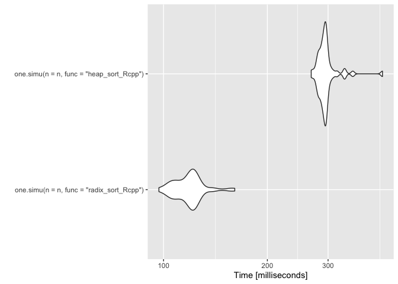
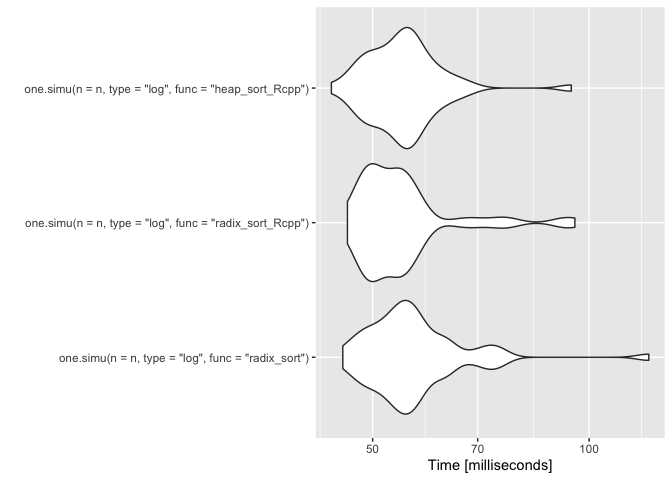
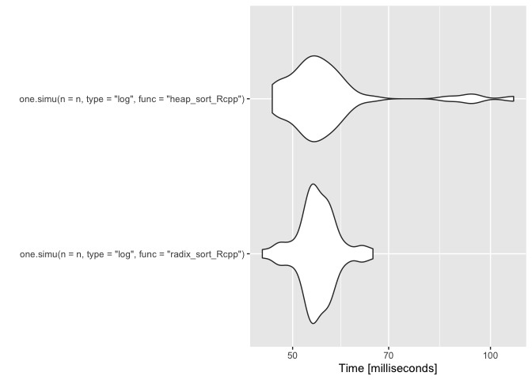
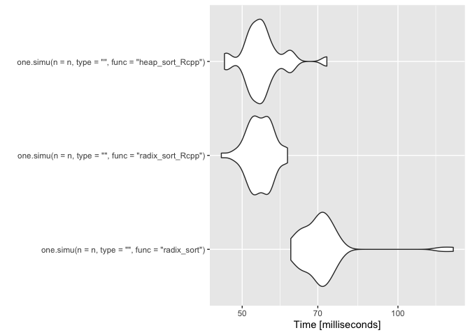
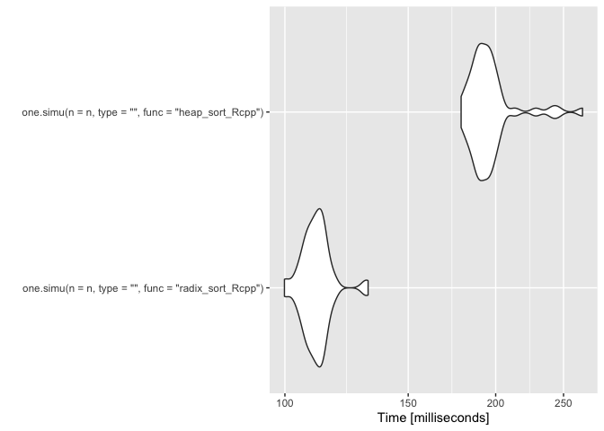
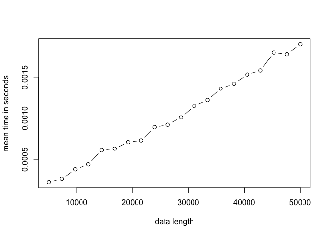

# Projet M2 Algorithmique

### Jawad Boulahfa, Kylliann De Santiago, Romain Brulé

#### M2 Data Science: Santé, Assurance, Finance

#### Université d’Evry Val d’Essonne

### 14 décembre 2020

> [Introduction](#intro)

> [Algorithmes de tri à n fixé](#n)

> [Microbenchmark](#micro)

> [Complexité](#complexity)

<a id="intro"></a>

## Introduction

Le package R `RadixSort` a été réalisé dans le cadre du projet
d’algorithmique. Le but de ce dernier est d’une part de coder
l’algorithme de tri radix sort à la fois en R et en Rcpp afin de
comparer les performances des deux méthodes et d’autre part de comparer
les performances de cet algorithme avec d’autres algorithmes de tri. Ce
fichier récapitule les simulations effectuées au cours de ce projet et
les conclusions qui en ont été tirées.

### Installation du package

Avant de commencer, on nettoie l’environnement de travail.

``` r
rm(list = ls())
```

Il faut avoir préalablement installé le package `devtools`. Ensuite, il
suffit de retirer le symbole “\#” et d’exécuter la ligne correspondante
pour installer le package RadixSort. On peut alors l’utiliser comme
n’importe quel autre package R via la commande: `library(RadixSort)`.

``` r
#devtools::install_github("Jawad-Boulahfa/RadixSort")
library(RadixSort)
```

### Premier essai

On effectue un premier essai en triant un vecteur de taille 10 issu d’un
tirage aléatoire (avec remise) d’entiers compris entre 1 et 10.

``` r
n <- 10
#v <- floor(runif(n, min=0, max=n))
v <- sample.int(n, replace = TRUE)
```

Vecteur à trier.

``` r
v
```

    ##  [1]  8  8  4  3  9  9  9  6  4 10

Radix sort avec la fonction codée en R.

``` r
radix_sort(v)
```

    ##  [1]  3  4  4  6  8  8  9  9  9 10

Radix sort avec la fonction codée en Rcpp.

``` r
radix_sort_Rcpp(v)
```

    ##  [1]  3  4  4  6  8  8  9  9  9 10

<a id="n"></a>

## Algorithmes de tri à n fixé

Le but de cette partie est de comparer les temps d’exécution de
plusieurs algorithmes de tri à \(n\) fixé. Plus précisément, on va
comparer les performances du radix sort avec le heap sort et l’insertion
sort. Dans ce but, on charge le package M2algorithmique (qu’il faut
avoir préalablement installé).

``` r
#devtools::install_github("vrunge/M2algorithmique")
library(M2algorithmique)
```

### Une simulation

Tout d’abord, on définit une fonction qui nous permettra d’exécuter une
simulation (i.e. un tri de vecteur) selon l’algorithme choisi et la
valeur de \(n\) fixée par l’utilisateur. On introduit également un
paramètre “type” qui permet de choisir la forme du vecteur à trier.

``` r
one.simu <- function(n, type = "sample", func = "radix_sort")
{
  if(type == "sample")
  {
    v <- sample.int(n, replace = TRUE) # Cas moyen: entiers aléatoires compris entre 1 et $n$.
  }
  else
  {
    # On mélange des nombres issus d'une échelle logarithmique
    # On veut voir si notre algorithme se comporte bien même si le vecteur à trier
    # comporte des valeurs très petites et très grandes
    if(type == "log")
    {
      # On commence par extraire la puissance de 10 utilisée pour n
      exposant <- log(n)/log(10)
      # On s'en sert pour construire un vecteur allant de -n à n par puissance de 10
      # On tire ensuite aléatoirement (avec remise) des éléments de ce vecteur
      # pour construire le vecteur à trier.
      # Problème 1: cela contraint à choisir un n de la forme : 10^exposant
      # Problème 2: vecteur trop petit
      v <- sample(10^(seq(0, exposant, length.out = exposant+1)), replace = TRUE)
    }
    else
    {
      v <- n:1 # Pire cas possible: vecteur rangé dans l'ordre décroissant
    }
  }
  if(func == "insertion_sort"){t <- system.time(insertion_sort(v))[[1]]}
  if(func == "heap_sort"){t <- system.time(heap_sort(v))[[1]]} 
  if(func == "insertion_sort_Rcpp"){t <- system.time(insertion_sort_Rcpp(v))[[1]]}
  if(func == "heap_sort_Rcpp"){t <- system.time(heap_sort_Rcpp(v))[[1]]}
  if(func == "radix_sort"){t <- system.time(radix_sort(v))[[1]]}
  if(func == "radix_sort_Rcpp"){t <- system.time(radix_sort_Rcpp(v))[[1]]}
  return(t)
}
```

``` r
n <- 10^5
```

On fait un premier essai de simulation pour chacun des algorithmes avec
\(n = 10^{5}\) afin d’illustrer le fonctionnement de `one.simu`.

``` r
one.simu(n = n, func = "radix_sort")
```

    ## [1] 0.18

``` r
one.simu(n = n, func = "radix_sort_Rcpp")
```

    ## [1] 0.005

``` r
# 35 secondes avec n = 10^5 : trop lent
# one.simu(n = n, func = "heap_sort")
```

``` r
one.simu(n = n, func = "heap_sort_Rcpp")
```

    ## [1] 0.029

``` r
# Trop lent sur de grosses données
# one.simu(n = n, func = "insertion_sort")
```

``` r
# Plus rapide 1.58 secondes pour n = 10^5, mais on ne va comparer qu'avec le heap sort ici
# one.simu(n = n, func = "insertion_sort_Rcpp")
```

### Simulations dans le “cas moyen”

On commence par s’intéresser aux performances de chaque algorithme dans
le “cas moyen”, i.e. lorsque les valeurs du vecteurs à trier sont issus
d’un tirage aléatoire (avec remise) d’entiers compris entre 1 et \(n\).

``` r
# Valeur de n (taille du vecteur à trier)
n <- 10^6

# Nombre de fois où on répète l'algorithme sur un vecteur de taille n
nbSimus <- 10

# Temps d'exécutions
t1 <- 0
t2 <- 0
#t3 <- 0
t4 <- 0
#t5 <- 0
#t6 <- 0

# Simulations
for(i in 1:nbSimus){t1 <- t1 + one.simu(n = n, func = "radix_sort")}
for(i in 1:nbSimus){t2 <- t2 + one.simu(n = n, func = "radix_sort_Rcpp")}
#for(i in 1:nbSimus){t3 <- t3 + one.simu(n = n, func = "heap_sort")}
for(i in 1:nbSimus){t4 <- t4 + one.simu(n = n, func = "heap_sort_Rcpp")}
#for(i in 1:nbSimus){t5 <- t5 + one.simu(n = n, func = "insertion_sort")}
#for(i in 1:nbSimus){t6 <- t6 + one.simu(n = n, func = "insertion_sort_Rcpp")}
```

On affiche les temps d’exécution pour effectuer 10 simulations.

``` r
t1 # temps d'exécution du radix sort en R
```

    ## [1] 18.218

``` r
t2 # temps d'exécution du radix sort en Rcpp
```

    ## [1] 0.541

``` r
# t3 # temps d'exécution du heap sort en R
t4 # temps d'exécution du heap sort en Rcpp
```

    ## [1] 2.683

Comparaison des temps d’exécution.

``` r
t1/t2 # radix sort gain R -> Rcpp
```

    ## [1] 33.67468

``` r
# t3/t4 # heap sort gain R -> Rcpp
# t5/t6 # insertion sort gain R -> Rcpp
# t1/t3 # comparaison radix sort en R et heap sort en R
t2/t4 # comparaison radix sort en Rcpp et heap sort en Rcpp
```

    ## [1] 0.20164

### Simulations dans le “cas logarithmique”

``` r
exposant <- 6
```

On s’intéresse maintenant aux performances de chaque algorithme dans le
“cas logarithmique”, i.e. lorsque les valeurs du vecteurs à trier sont
issus d’un tirage aléatoire (avec remise) de puissances de 10 comprises
entre 1 et \(10^{6}\) (Partie à retravailler à cause des problèmes
rencontrés: taille du vecteur trop petite).

``` r
# Valeur de n (taille du vecteur à trier)
n <- 10^(exposant)

# Nombre de fois où on répète l'algorithme sur un vecteur de taille n
nbSimus <- 10

# Temps d'exécutions
t1_log <- 0
t2_log <- 0
#t3_log <- 0
t4_log <- 0
t5_log <- 0
t6_log <- 0

# Simulations
for(i in 1:nbSimus){t1_log <- t1_log + one.simu(n = n, type = "log", func = "radix_sort")}
for(i in 1:nbSimus){t2_log <- t2_log + one.simu(n = n, type = "log", func = "radix_sort_Rcpp")}
#for(i in 1:nbSimus){t3_log <- t3_log + one.simu(n = n, type = "log", func = "heap_sort")}
for(i in 1:nbSimus){t4_log <- t4_log + one.simu(n = n, type = "log", func = "heap_sort_Rcpp")}
#for(i in 1:nbSimus){t5_log <- t5_log + one.simu(n = n, type = "log", func = "insertion_sort")}
#for(i in 1:nbSimus){t6_log <- t6_log + one.simu(n = n, type = "log", func = "insertion_sort_Rcpp")}
```

On affiche les temps d’exécution pour effectuer 10 simulations.

``` r
t1_log # temps d'exécution du radix sort en R
```

    ## [1] 0

``` r
t2_log # temps d'exécution du radix sort en Rcpp
```

    ## [1] 0

``` r
#t3_log # temps d'exécution du heap sort en R
t4_log # temps d'exécution du heap sort en Rcpp
```

    ## [1] 0

Comparaison des temps d’exécution.

``` r
t1_log/t2_log # radix sort gain R -> Rcpp
```

    ## [1] NaN

``` r
#t3_log/t4_log # heap sort gain R -> Rcpp
# t5_log/t6_log # insertion sort gain R -> Rcpp
#t1_log/t3_log # comparaison radix sort en R et heap sort en R
t2_log/t4_log # comparaison radix sort en Rcpp et heap sort en Rcpp
```

    ## [1] NaN

### Simulations dans le “pire des cas”

On s’intéresse maintenant aux performances de chaque algorithme dans le
“pire des cas”, i.e. lorsque les valeurs du vecteurs à trier sont
rangées dans l’ordre décroissant.

``` r
# Valeur de n (taille du vecteur à trier)
n <- 10^6

# Nombre de fois où on répète l'algorithme sur un vecteur de taille n
nbSimus <- 10

# Temps d'exécutions
t1_worst <- 0
t2_worst <- 0
#t3_worst <- 0
t4_worst <- 0
#t5_worst <- 0
#t6_worst <- 0

# Simulations
for(i in 1:nbSimus){t1_worst <- t1_worst + one.simu(n = n, type = "", func = "radix_sort")}
for(i in 1:nbSimus){t2_worst <- t2_worst + one.simu(n = n, type = "", func = "radix_sort_Rcpp")}
#for(i in 1:nbSimus){t3_worst <- t3_worst + one.simu(n = n, type = "", func = "heap_sort")}
for(i in 1:nbSimus){t4_worst <- t4_worst + one.simu(n = n, type = "", func = "heap_sort_Rcpp")}
#for(i in 1:nbSimus){t5_worst <- t5_worst + one.simu(n = n, type = "", func = "insertion_sort")}
#for(i in 1:nbSimus){t6_worst <- t6_worst + one.simu(n = n, type = "", func = "insertion_sort_Rcpp")}
```

On affiche les temps d’exécution pour effectuer 10 simulations.

``` r
t1_worst # temps d'exécution du radix sort en R
```

    ## [1] 19.179

``` r
t2_worst # temps d'exécution du radix sort en Rcpp
```

    ## [1] 0.524

``` r
#t3_worst # temps d'exécution du heap sort en R
t4_worst # temps d'exécution du heap sort en Rcpp
```

    ## [1] 1.373

Comparaison des temps d’exécution.

``` r
t1_worst/t2_worst # radix sort gain R -> Rcpp
```

    ## [1] 36.60115

``` r
# t3_worst/t4_worst # heap sort gain R -> Rcpp
# t5_worst/t6_worst # insertion sort gain R -> Rcpp
# t1_worst/t3_worst # comparaison radix sort en R et heap sort en R
t2_worst/t4_worst # comparaison radix sort en Rcpp et heap sort en Rcpp
```

    ## [1] 0.381646

<a id="micro"></a>

## Microbenchmark

``` r
library(microbenchmark)
library(ggplot2)
```

### Comparaison entre le radix sort en R, le radix sort en Rcpp et le heap sort en Rcpp (“cas moyen”)

On commence par comparer les 3 algorithmes en même temps. Sur cet
exemple, avec un vecteur de taille \(10^4\), on remarque que le radix
sort en R est le moins bon des 3. Le radix sort en Rcpp semble meilleur
que le heap sort en Rcpp, mais pour confirmer cela, nous allons faire un
second essai avec un vecteur plus grand.

``` r
n <- 10^4
res <- microbenchmark(one.simu(n = n, func = "radix_sort"),
                      one.simu(n = n, func = "radix_sort_Rcpp"),
                      one.simu(n = n, func = "heap_sort_Rcpp"), times = 50)
autoplot(res)
```

    ## Coordinate system already present. Adding new coordinate system, which will replace the existing one.

<!-- -->

``` r
print(res)
```

    ## Unit: milliseconds
    ##                                       expr      min       lq     mean   median
    ##       one.simu(n = n, func = "radix_sort") 51.52939 58.34933 63.41493 62.26542
    ##  one.simu(n = n, func = "radix_sort_Rcpp") 37.75791 43.30638 46.48574 46.78209
    ##   one.simu(n = n, func = "heap_sort_Rcpp") 40.66138 44.99493 47.75972 48.09850
    ##        uq       max neval
    ##  65.15973 114.93432    50
    ##  48.07576  71.73819    50
    ##  50.39420  67.87900    50

### Comparaison entre le radix sort en Rcpp et le heap sort en Rcpp (“cas moyen”)

On fait maintenant un second essai avec une plus grande taille pour le
vecteur à trier (\(n = 10^6\) ici). On remarque le radix sort est
meilleur que le heap sort. Ce qui est cohérent avec les résultats
précédents (partie `Simulations dans le "cas moyen"`).

``` r
n <- 10^6
res <- microbenchmark(one.simu(n = n, func = "radix_sort_Rcpp"),
                      one.simu(n = n, func = "heap_sort_Rcpp"), times = 50)
autoplot(res)
```

    ## Coordinate system already present. Adding new coordinate system, which will replace the existing one.

<!-- -->

``` r
print(res)
```

    ## Unit: milliseconds
    ##                                       expr       min       lq     mean   median
    ##  one.simu(n = n, func = "radix_sort_Rcpp")  96.96154 110.5100 118.8427 120.0927
    ##   one.simu(n = n, func = "heap_sort_Rcpp") 268.04721 286.4723 297.0618 293.1333
    ##        uq      max neval
    ##  123.8785 160.8967    50
    ##  297.1401 431.4280    50

### Comparaison entre le radix sort en R, le radix sort en Rcpp et le heap sort en Rcpp (“cas logarithmique”)

Partie à retravailler à cause des problèmes de ces simulations (taille
trop petite notamment).

``` r
exposant <- 4
```

``` r
n <- 10^(exposant)
res <- microbenchmark(one.simu(n = n, type = "log", func = "radix_sort"),
                      one.simu(n = n, type = "log", func = "radix_sort_Rcpp"),
                      one.simu(n = n, type = "log", func = "heap_sort_Rcpp"), times = 50)
autoplot(res)
```

    ## Coordinate system already present. Adding new coordinate system, which will replace the existing one.

<!-- -->

``` r
print(res)
```

    ## Unit: milliseconds
    ##                                                     expr      min       lq
    ##       one.simu(n = n, type = "log", func = "radix_sort") 45.44549 51.52720
    ##  one.simu(n = n, type = "log", func = "radix_sort_Rcpp") 46.12505 49.39103
    ##   one.simu(n = n, type = "log", func = "heap_sort_Rcpp") 43.81437 50.69965
    ##      mean   median       uq       max neval
    ##  57.84659 55.61273 58.73158 121.08153    50
    ##  55.51660 53.60597 56.24645  95.55334    50
    ##  55.55614 55.47382 57.66596  94.46616    50

### Comparaison entre le radix sort en Rcpp et le heap sort en Rcpp (“cas logarithmique”)

Idem.

``` r
exposant <- 8
```

``` r
n <- 10^(exposant)
res <- microbenchmark(one.simu(n = n, type = "log", func = "radix_sort_Rcpp"),
                      one.simu(n = n, type = "log", func = "heap_sort_Rcpp"), times = 50)
autoplot(res)
```

    ## Coordinate system already present. Adding new coordinate system, which will replace the existing one.

<!-- -->

``` r
print(res)
```

    ## Unit: milliseconds
    ##                                                     expr      min       lq
    ##  one.simu(n = n, type = "log", func = "radix_sort_Rcpp") 44.96991 52.70741
    ##   one.simu(n = n, type = "log", func = "heap_sort_Rcpp") 46.55884 51.59890
    ##      mean   median       uq       max neval
    ##  54.68255 54.17014 56.68594  66.25204    50
    ##  57.32136 54.42320 57.60935 108.45452    50

### Comparaison entre le radix sort en R, le radix sort en Rcpp et le heap sort en Rcpp (“pire des cas”)

On commence par comparer les 3 algorithmes en même temps. Sur cet
exemple, avec un vecteur de taille \(10^4\), on remarque que le radix
sort en R est une fois encore le plus lent.

Le heap sort en Rcpp semble meilleur que le radix sort en Rcpp, mais
pour confirmer cela, nous allons faire un second essai avec un vecteur
plus grand.

``` r
n <- 10^4
res <- microbenchmark(one.simu(n = n, type = "", func = "radix_sort"),
                      one.simu(n = n, type = "", func = "radix_sort_Rcpp"),
                      one.simu(n = n, type = "", func = "heap_sort_Rcpp"), times = 50)
autoplot(res)
```

    ## Coordinate system already present. Adding new coordinate system, which will replace the existing one.

<!-- -->

``` r
print(res)
```

    ## Unit: milliseconds
    ##                                                  expr      min       lq
    ##       one.simu(n = n, type = "", func = "radix_sort") 62.07385 66.64388
    ##  one.simu(n = n, type = "", func = "radix_sort_Rcpp") 45.56667 51.98425
    ##   one.simu(n = n, type = "", func = "heap_sort_Rcpp") 46.21004 51.76399
    ##      mean   median       uq       max neval
    ##  72.12120 70.86287 73.92523 127.92314    50
    ##  54.23437 54.16456 56.30185  61.17326    50
    ##  54.88619 54.19298 55.77548  72.88464    50

### Comparaison entre le radix sort en Rcpp et le heap sort en Rcpp (“pire des cas”)

On fait maintenant un second essai avec une plus grande taille pour le
vecteur à trier (\(n = 10^6\) ici). On remarque le radix sort est
meilleur que le heap sort ici. Ainsi, le heap sort est légèrement
meilleur que le radix sort seulement sur de plus petites tailles de
données.

``` r
n <- 10^6
res <- microbenchmark(one.simu(n = n, type = "", func = "radix_sort_Rcpp"),
                      one.simu(n = n, type = "", func = "heap_sort_Rcpp"), times = 50)
autoplot(res)
```

    ## Coordinate system already present. Adding new coordinate system, which will replace the existing one.

<!-- -->

``` r
print(res)
```

    ## Unit: milliseconds
    ##                                                  expr       min       lq
    ##  one.simu(n = n, type = "", func = "radix_sort_Rcpp")  99.84463 107.5945
    ##   one.simu(n = n, type = "", func = "heap_sort_Rcpp") 178.51413 187.7853
    ##      mean   median       uq      max neval
    ##  110.9527 110.5772 113.0633 131.4692    50
    ##  196.3420 193.3214 198.0874 266.1057    50

<a id="complexity"></a>

## Complexité

Le but de cette partie est d’évaluer la complexité du radix sort dans le
“cas moyen”.

### Radix sort en R

On lance \(nbRep = 100\) fois l’algorithme radix sort pour chaque valeur
du vecteur `vector_n` de taille \(nbSimus = 20\). On affiche le graphe
du temps d’exécution moyen en fonction de la taille des données.

``` r
nbSimus <- 20
vector_n <- seq(from = 5000, to = 50000, length.out = nbSimus)
nbRep <- 100
res_radix <- data.frame(matrix(0, nbSimus, nbRep + 1))
colnames(res_radix) <- c("n", paste0("Rep",1:nbRep))

j <- 1
for(i in vector_n)
{
  res_radix[j,] <- c(i, replicate(nbRep, one.simu(i, func = "radix_sort")))  
  #print(j)
  j <- j + 1
}

res <- rowMeans(res_radix[,-1])
plot(vector_n, res, type = 'b', xlab = "data length", ylab = "mean time in seconds")
```

<!-- -->

``` r
lm(res ~ vector_n)
```

    ## 
    ## Call:
    ## lm(formula = res ~ vector_n)
    ## 
    ## Coefficients:
    ## (Intercept)     vector_n  
    ##   2.308e-03    1.516e-06

### Radix sort en Rcpp

En Rcpp, on constate qu’on gagne énormément de temps par rapport au code
R.

``` r
nbSimus <- 20
vector_n <- seq(from = 5000, to = 50000, length.out = nbSimus)
nbRep <- 100
res_radix_rcpp <- data.frame(matrix(0, nbSimus, nbRep + 1))
colnames(res_radix_rcpp) <- c("n", paste0("Rep",1:nbRep))

j <- 1
for(i in vector_n)
{
  res_radix_rcpp[j,] <- c(i, replicate(nbRep, one.simu(i, func = "radix_sort_Rcpp")))  
  #print(j)
  j <- j + 1
}

res <- rowMeans(res_radix_rcpp[,-1])
plot(vector_n, res, type = 'b', xlab = "data length", ylab = "mean time in seconds")
```

<!-- -->

### Heap sort en Rcpp

Généralement le heap sort en Rcpp est plus lent que le radix sort en
Rcpp ce qui est cohérent avec les résultats précédents (partie
`Comparaison entre le radix sort en Rcpp et le heap sort en Rcpp ("cas
moyen")`).

``` r
nbSimus <- 20
vector_n <- seq(from = 5000, to = 50000, length.out = nbSimus)
nbRep <- 100
res_heap_sort_rcpp <- data.frame(matrix(0, nbSimus, nbRep + 1))
colnames(res_heap_sort_rcpp) <- c("n", paste0("Rep",1:nbRep))

j <- 1
for(i in vector_n)
{
  res_heap_sort_rcpp[j,] <- c(i, replicate(nbRep, one.simu(i, func = "heap_sort_Rcpp")))  
  #print(j)
  j <- j + 1
}

res <- rowMeans(res_heap_sort_rcpp[,-1])
plot(vector_n, res, type = 'b', xlab = "data length", ylab = "mean time in seconds")
```

<!-- -->

Plus le nombre d’éléments à stocker est grand, plus la différence entre
le heap sort et le radix sort se fait grande.
