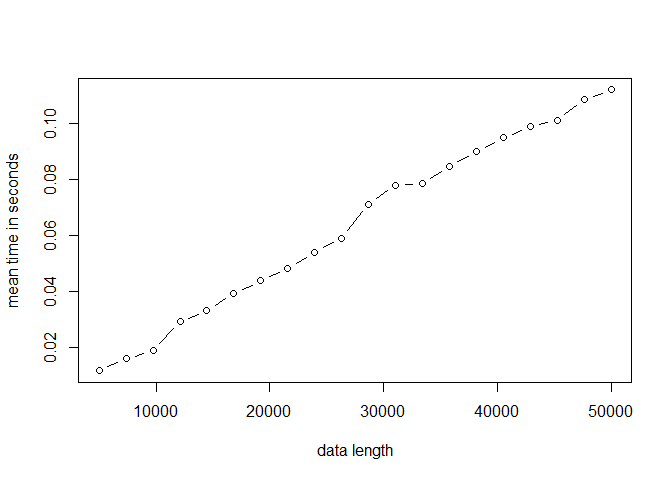
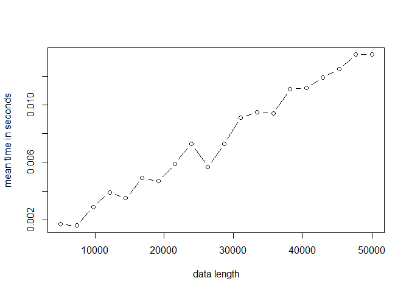

# Projet M2 Algorithmique

### Jawad Boulahfa, Kylliann De Santiago, Romain Brulé

#### M2 Data Science: Santé, Assurance, Finance

#### Université d’Evry Val d’Essonne

### 9 janvier 2021

> [Introduction](#intro)

> [Algorithmes de tri à n fixé](#n)

> [Microbenchmark](#micro)

> [Complexité](#complexity)

<a id="intro"></a>

## Introduction

Le package R `RadixSort` a été réalisé dans le cadre du projet
d’algorithmique. Le but de ce dernier est d’une part de coder
l’algorithme de tri radix sort à la fois en R et en Rcpp afin de
comparer les performances des deux méthodes et d’autre part de comparer
les performances de cet algorithme avec d’autres algorithmes de tri. Ce
fichier récapitule les simulations effectuées au cours de ce projet et
les conclusions qui en ont été tirées.

### Installation du package

Avant de commencer, on nettoie l’environnement de travail.

``` r
rm(list = ls())
```

Il faut avoir préalablement installé le package `devtools`. Ensuite, il
suffit de retirer le symbole “\#” et d’exécuter la ligne correspondante
pour installer le package RadixSort. On peut alors l’utiliser comme
n’importe quel autre package R via la commande: `library(RadixSort)`.

``` r
#devtools::install_github("Jawad-Boulahfa/RadixSort")
library(RadixSort)
```

On charge aussi le package M2algorithmique (qu’il faut également avoir
préalablement installé) dont on aura besoin lorsque l’on utilisera le
heap sort.

``` r
#devtools::install_github("vrunge/M2algorithmique")
library(M2algorithmique)
```

### Premier essai

On effectue un premier essai en triant un vecteur de taille 10 issu d’un
tirage aléatoire (avec remise) d’entiers compris entre 1 et 10.

``` r
n <- 10
#V <- floor(runif(n, min=0, max=n))
V <- sample.int(n, replace = TRUE)
```

Vecteur à trier.

``` r
V
```

    ##  [1] 4 1 2 3 5 8 8 9 4 7

Radix sort avec la fonction codée en R.

``` r
radix_sort(V)
```

    ##  [1] 1 2 3 4 4 5 7 8 8 9

Radix sort avec la fonction codée en Rcpp.

``` r
radix_sort_Rcpp(V)
```

    ##  [1] 1 2 3 4 4 5 7 8 8 9

Heap sort avec la fonction codée en R.

``` r
heap_sort(V)
```

    ##  [1] 1 2 3 4 4 5 7 8 8 9

Heap sort avec la fonction codée en Rcpp.

``` r
heap_sort_Rcpp(V)
```

    ##  [1] 1 2 3 4 4 5 7 8 8 9

Quick sort avec la fonction codée en R.

``` r
quick_sort_opti(V)
```

    ##  [1] 1 2 3 4 4 5 7 8 8 9

Quick sort avec la fonction codée en Rcpp.

``` r
quick_sort_Rcpp_opti(V)
```

    ##  [1] 1 2 3 4 4 5 7 8 8 9

<a id="n"></a>

## Algorithmes de tri à n fixé

Le but de cette partie est de comparer les temps d’exécution de
plusieurs algorithmes de tri à \(n\) fixé. Plus précisément, on va
comparer les performances du radix sort avec le heap sort et le quick
sort.

### Une simulation

Tout d’abord, on définit une fonction qui nous permettra d’exécuter une
simulation (i.e. un tri de vecteur) selon l’algorithme de tri choisi et
la taille \(n\) du vecteur fixée par l’utilisateur. On introduit
également un paramètre “type” qui permet de choisir la forme du vecteur
à trier.

``` r
one.simu <- function(n, type = "integer", func = "radix_sort", precision = 5)
{
  ### Choix du type de vecteur à trier ###
  
  # Tire n nombres entiers aléatoires compris entre 1 et n
  if(type == "integer")
  {
    V <- sample.int(n, replace = TRUE) # Cas moyen: entiers aléatoires compris entre 1 et $n$.
  }
  
  # Tire n nombres entiers aléatoires compris entre -n et n (sauf 0)
  if(type == "negative integer")
  {
    sign <- runif(n,min=0,max=1)
    sign[sign >= 0.5] <- 1
    sign[sign < 0.5] <- -1
    V <- sample.int(n, replace = TRUE)*sign
  }
  
  # Tire n nombres décimaux aléatoires compris entre 0 et n
  if(type == "decimal")
  {
    V <- round(runif(n, min=0, max = n), precision)
  }
  
  # Tire n nombres décimaux aléatoires compris entre -n et n
  if(type == "negative decimal")
  {
    sign <- runif(n,min=0,max=1)
    sign[sign>=0.5] <- 1
    sign[sign<0.5] <- -1
    V <- round(runif(n, min=0, max = n)*sign, precision) 
  }
  
  # Construit un vecteur contenant tout les nombres entiers de n à 1 (ordre décroissant)
  if(type == "reverse")
  {
    V <- n:1 
  }
  
  ### Choix de l'algorithme de tri ###
  
  # Ici, on calcule le temps d'exécution de l'algorithme de tri choisi
  
  if(func == "radix_sort"){t <- system.time(radix_sort(V))[[1]]}
  if(func == "radix_sort_Rcpp"){t <- system.time(radix_sort_Rcpp(V))[[1]]}
  
  if(func == "radix_sort_decimal"){t <- system.time(radix_sort_decimal(V))[[1]]}
  if(func == "radix_sort_Rcpp_decimal"){t <- system.time(radix_sort_Rcpp_decimal(V))[[1]]}
  
  if(func == "heap_sort"){t <- system.time(heap_sort(V))[[1]]} 
  if(func == "heap_sort_Rcpp"){t <- system.time(heap_sort_Rcpp(V))[[1]]}
  
  if(func == "quick_sort_opti"){t <- system.time(quick_sort_opti(V))[[1]]}
  if(func == "quick_sort_Rcpp_opti"){t <- system.time(quick_sort_Rcpp_opti(V))[[1]]}


  return(t)
}
```

``` r
n <- 10^4
```

On fait une première simulation pour chacun des algorithmes avec
\(n = 10^{4}\) afin d’illustrer le fonctionnement de `one.simu`. Par
défaut, le vecteur a trier est issu d’un tirage aléatoire (avec remise)
d’entiers compris entre 1 et \(n\).

``` r
one.simu(n = n, func = "radix_sort")
```

    ## [1] 0.03

``` r
one.simu(n = n, func = "radix_sort_Rcpp")
```

    ## [1] 0.02

``` r
one.simu(n = n, func = "heap_sort")
```

    ## [1] 0.28

``` r
one.simu(n = n, func = "heap_sort_Rcpp")
```

    ## [1] 0

``` r
one.simu(n = n, func = "quick_sort_opti")
```

    ## [1] 0.08

``` r
one.simu(n = n, func = "quick_sort_Rcpp_opti")
```

    ## [1] 0.02

On conclut que les algorithmes les plus rapides sont le radix sort
(version Rcpp) et le heap sort (version Rcpp) sur ce premier essai. Le
plus lent est le heap sort (version R). On peut également noter un gain
de temps considérable entre le heap sort (version R) et le heap sort
(version Rcpp). Dans tout les cas, le code en Rcpp est toujours plus
rapide que le code en R.

### Simulations avec des nombres entiers naturels

On commence par s’intéresser aux performances de chaque algorithme dans
le cas où les valeurs du vecteurs à trier sont issus d’un tirage
aléatoire (avec remise) d’entiers compris entre 1 et \(n\).

``` r
# Valeur de n (taille du vecteur à trier)
n <- 10^4

# Nombre de fois où on répète l'algorithme sur un vecteur de taille n
nbSimus <- 10

# Temps d'exécutions
t1 <- 0
t2 <- 0
t3 <- 0
t4 <- 0
t5 <- 0
t6 <- 0

# Simulations
for(i in 1:nbSimus){t1 <- t1 + one.simu(n = n, type = "integer", func = "radix_sort")}
for(i in 1:nbSimus){t2 <- t2 + one.simu(n = n, type = "integer", func = "radix_sort_Rcpp")}
for(i in 1:nbSimus){t3 <- t3 + one.simu(n = n, type = "integer", func = "heap_sort")}
for(i in 1:nbSimus){t4 <- t4 + one.simu(n = n, type = "integer", func = "heap_sort_Rcpp")}
for(i in 1:nbSimus){t5 <- t5 + one.simu(n = n, type = "integer", func = "quick_sort_opti")}
for(i in 1:nbSimus){t6 <- t6 + one.simu(n = n, type = "integer", func = "quick_sort_Rcpp_opti")}
```

On affiche les temps d’exécution pour effectuer 10 simulations.

``` r
t1 # temps d'exécution du radix sort en R
```

    ## [1] 0.2

``` r
t2 # temps d'exécution du radix sort en Rcpp
```

    ## [1] 0

``` r
t3 # temps d'exécution du heap sort en R
```

    ## [1] 3.08

``` r
t4 # temps d'exécution du heap sort en Rcpp
```

    ## [1] 0.02

``` r
t5 # temps d'exécution du quick sort en R
```

    ## [1] 0.78

``` r
t6 # temps d'exécution du quick sort en Rcpp
```

    ## [1] 0.12

On remarque que heap sort (version R) est à nouveau le plus lent de
tous. Cependant, l’algorithme le plus rapide est le radix sort (version
Rcpp) suivi du heap sort (version Rcpp) alors que sur notre premier
essai, ces deux algorithmes avaient la même performance. Concernant le
quick sort, ce dernier est assez lent comparé aux autres que ce soit en
R ou en Rcpp (0.12 secondes pour la version Rcpp). Ainsi, effectuer
davantage de simulations nous a permis de mieux comparer les
algorithmes.

Calcul du gain en passant de R à Rcpp.

``` r
t1/t2 # radix sort gain R -> Rcpp
```

    ## [1] Inf

``` r
t3/t4 # heap sort gain R -> Rcpp
```

    ## [1] 154

``` r
t5/t6 # quick sort gain R -> Rcpp
```

    ## [1] 6.5

Le code est Rcpp est toujours bien plus rapide que celui en R. Par
exemple, le radix sort en Rcpp est  fois plus rapide qu’en R.

Comparaison des temps d’exécution en R.

``` r
t1/t3 # comparaison radix sort en R et heap sort en R
```

    ## [1] 0.06493506

``` r
t1/t5 # comparaison radix sort en R et quick sort en R
```

    ## [1] 0.2564103

``` r
t3/t5 # comparaison heap sort en R et quick sort en R
```

    ## [1] 3.948718

En R, le radix sort est plus rapide que le heap sort et le quick sort.
Enfin, le quick sort est environ 3.95 fois plus rapide que le heap sort.

Comparaison des temps d’exécution en Rcpp.

``` r
t2/t4 # comparaison radix sort en Rcpp et heap sort en Rcpp
```

    ## [1] 0

``` r
t2/t6 # comparaison radix sort en Rcpp et quick sort en Rcpp
```

    ## [1] 0

``` r
t4/t6 # comparaison heap sort en Rcpp et quick sort en Rcpp
```

    ## [1] 0.1666667

En Rcpp, c’est clairement le radix sort qui permet les meilleurs gains
de temps.

### Simulations avec des nombres entiers relatifs

On s’intéresse ici aux performances de chaque algorithme dans le cas où
les valeurs du vecteurs à trier sont issus d’un tirage aléatoire (avec
remise) d’entiers compris entre \(-n\) et \(n\).

``` r
# Valeur de n (taille du vecteur à trier)
n <- 10^4

# Nombre de fois où on répète l'algorithme sur un vecteur de taille n
nbSimus <- 10

# Temps d'exécutions
t1 <- 0
t2 <- 0
t3 <- 0
t4 <- 0
t5 <- 0
t6 <- 0

# Simulations
for(i in 1:nbSimus){t1 <- t1 + one.simu(n = n, type = "negative integer",
                                        func = "radix_sort")}
for(i in 1:nbSimus){t2 <- t2 + one.simu(n = n, type = "negative integer",
                                        func = "radix_sort_Rcpp")}
for(i in 1:nbSimus){t3 <- t3 + one.simu(n = n, type = "negative integer",
                                        func = "heap_sort")}
for(i in 1:nbSimus){t4 <- t4 + one.simu(n = n, type = "negative integer",
                                        func = "heap_sort_Rcpp")}
for(i in 1:nbSimus){t5 <- t5 + one.simu(n = n, type = "negative integer",
                                        func = "quick_sort_opti")}
for(i in 1:nbSimus){t6 <- t6 + one.simu(n = n, type = "negative integer",
                                        func = "quick_sort_Rcpp_opti")}
```

On affiche les temps d’exécution pour effectuer 10 simulations.

``` r
t1 # temps d'exécution du radix sort en R
```

    ## [1] 0.17

``` r
t2 # temps d'exécution du radix sort en Rcpp
```

    ## [1] 0.06

``` r
t3 # temps d'exécution du heap sort en R
```

    ## [1] 5.14

``` r
t4 # temps d'exécution du heap sort en Rcpp
```

    ## [1] 0.02

``` r
t5 # temps d'exécution du quick sort en R
```

    ## [1] 0.82

``` r
t6 # temps d'exécution du quick sort en Rcpp
```

    ## [1] 0.11

On peut noter ici la grande efficacité du heap sort (version Rcpp) sur
ces données. Le radix sort (version Rcpp) est également très performant.

Calcul du gain en passant de R à Rcpp.

``` r
t1/t2 # radix sort gain R -> Rcpp
```

    ## [1] 2.833333

``` r
t3/t4 # heap sort gain R -> Rcpp
```

    ## [1] 257

``` r
t5/t6 # quick sort gain R -> Rcpp
```

    ## [1] 7.454545

Comparaison des temps d’exécution en R.

``` r
t1/t3 # comparaison radix sort en R et heap sort en R
```

    ## [1] 0.03307393

``` r
t1/t5 # comparaison radix sort en R et quick sort en R
```

    ## [1] 0.2073171

``` r
t3/t5 # comparaison heap sort en R et quick sort en R
```

    ## [1] 6.268293

En R, le radix sort est plus rapide que le heap sort et le quick sort.
Enfin, le quick sort est environ 6.27 fois plus rapide que le heap sort.

Comparaison des temps d’exécution en Rcpp.

``` r
t2/t4 # comparaison radix sort en Rcpp et heap sort en Rcpp
```

    ## [1] 3

``` r
t2/t6 # comparaison radix sort en Rcpp et quick sort en Rcpp
```

    ## [1] 0.5454545

``` r
t4/t6 # comparaison heap sort en Rcpp et quick sort en Rcpp
```

    ## [1] 0.1818182

En Rcpp, c’est clairement le heap sort qui permet les meilleurs gains de
temps ici contrairement aux simulations précédentes (avec les entiers
naturels).

Il est intéressant de noter qu’avec des entiers relatifs, le heap sort
(version Rcpp) est meilleur que le radix sort (version Rcpp) et le radix
sort et meilleur que le quick sort (pour les deux versions).

### Simulations avec des nombres décimaux positifs

On commence par s’intéresser aux performances de chaque algorithme dans
le cas où les valeurs du vecteurs à trier sont issus d’un tirage
aléatoire de nombres décimaux positifs compris entre 0 et \(n\) (avec
une précision de \(10^{-5}\)).

``` r
# Valeur de n (taille du vecteur à trier)
n <- 10^4

# Nombre de fois où on répète l'algorithme sur un vecteur de taille n
nbSimus <- 10

# Temps d'exécutions
t1 <- 0
t2 <- 0
t3 <- 0
t4 <- 0
t5 <- 0
t6 <- 0

# Simulations
for(i in 1:nbSimus){t1 <- t1 + one.simu(n = n, type = "decimal", func = "radix_sort_decimal")}
for(i in 1:nbSimus){t2 <- t2 + one.simu(n = n, type = "decimal", func = "radix_sort_Rcpp_decimal")}
for(i in 1:nbSimus){t3 <- t3 + one.simu(n = n, type = "decimal", func = "heap_sort")}
for(i in 1:nbSimus){t4 <- t4 + one.simu(n = n, type = "decimal", func = "heap_sort_Rcpp")}
for(i in 1:nbSimus){t5 <- t5 + one.simu(n = n, type = "decimal", func = "quick_sort_opti")}
for(i in 1:nbSimus){t6 <- t6 + one.simu(n = n, type = "decimal", func = "quick_sort_Rcpp_opti")}
```

On affiche les temps d’exécution pour effectuer 10 simulations.

``` r
t1 # temps d'exécution du radix sort en R
```

    ## [1] 0.61

``` r
t2 # temps d'exécution du radix sort en Rcpp
```

    ## [1] 0.07

``` r
t3 # temps d'exécution du heap sort en R
```

    ## [1] 4.73

``` r
t4 # temps d'exécution du heap sort en Rcpp
```

    ## [1] 0.02

``` r
t5 # temps d'exécution du quick sort en R
```

    ## [1] 0.93

``` r
t6 # temps d'exécution du quick sort en Rcpp
```

    ## [1] 0.09

Calcul du gain en passant de R à Rcpp.

``` r
t1/t2 # radix sort gain R -> Rcpp
```

    ## [1] 8.714286

``` r
t3/t4 # heap sort gain R -> Rcpp
```

    ## [1] 236.5

``` r
t5/t6 # quick sort gain R -> Rcpp
```

    ## [1] 10.33333

Comparaison des temps d’exécution en R.

``` r
t1/t3 # comparaison radix sort en R et heap sort en R
```

    ## [1] 0.1289641

``` r
t1/t5 # comparaison radix sort en R et quick sort en R
```

    ## [1] 0.655914

``` r
t3/t5 # comparaison heap sort en R et quick sort en R
```

    ## [1] 5.086022

Comparaison des temps d’exécution en Rcpp.

``` r
t2/t4 # comparaison radix sort en Rcpp et heap sort en Rcpp
```

    ## [1] 3.5

``` r
t2/t6 # comparaison radix sort en Rcpp et quick sort en Rcpp
```

    ## [1] 0.7777778

``` r
t4/t6 # comparaison heap sort en Rcpp et quick sort en Rcpp
```

    ## [1] 0.2222222

Cette fois-ci, le radix sort est 3.5 fois plus lent que le heap sort.

Là encore, le heap sort (version Rcpp) affiche les meilleures
performances. Malgré notre adaptation du radix sort pour le tri des
nombres décimaux, ce dernier, quelque soit la version considérée, reste
plus lent que le heap sort (version Rcpp). Cependant, le radix sort
reste meilleur que le quick sort (pour les deux versions).

### Simulations avec des nombres décimaux signés

On commence par s’intéresser aux performances de chaque algorithme dans
le cas où les valeurs du vecteurs à trier sont issus d’un tirage
aléatoire de nombres décimaux signés compris entre \(-n\) et \(n\)
(avec une précision de \(10^{-5}\)).

``` r
# Valeur de n (taille du vecteur à trier)
n <- 10^4

# Nombre de fois où on répète l'algorithme sur un vecteur de taille n
nbSimus <- 10

# Temps d'exécutions
t1 <- 0
t2 <- 0
t3 <- 0
t4 <- 0
t5 <- 0
t6 <- 0

# Simulations
for(i in 1:nbSimus){t1 <- t1 + one.simu(n = n, type = "negative decimal",
                                        func = "radix_sort_decimal")}
for(i in 1:nbSimus){t2 <- t2 + one.simu(n = n, type = "negative decimal",
                                        func = "radix_sort_Rcpp_decimal")}
for(i in 1:nbSimus){t3 <- t3 + one.simu(n = n, type = "negative decimal",
                                        func = "heap_sort")}
for(i in 1:nbSimus){t4 <- t4 + one.simu(n = n, type = "negative decimal",
                                        func = "heap_sort_Rcpp")}
for(i in 1:nbSimus){t5 <- t5 + one.simu(n = n, type = "negative decimal",
                                        func = "quick_sort_opti")}
for(i in 1:nbSimus){t6 <- t6 + one.simu(n = n, type = "negative decimal",
                                        func = "quick_sort_Rcpp_opti")}
```

On affiche les temps d’exécution pour effectuer 10 simulations.

``` r
t1 # temps d'exécution du radix sort en R
```

    ## [1] 0.62

``` r
t2 # temps d'exécution du radix sort en Rcpp
```

    ## [1] 0.08

``` r
t3 # temps d'exécution du heap sort en R
```

    ## [1] 4.81

``` r
t4 # temps d'exécution du heap sort en Rcpp
```

    ## [1] 0.02

``` r
t5 # temps d'exécution du quick sort en R
```

    ## [1] 0.94

``` r
t6 # temps d'exécution du quick sort en Rcpp
```

    ## [1] 0.13

Comparaison des temps d’exécution.

``` r
t1/t2 # radix sort gain R -> Rcpp
```

    ## [1] 7.75

``` r
t3/t4 # heap sort gain R -> Rcpp
```

    ## [1] 240.5

``` r
t5/t6 # quick sort gain R -> Rcpp
```

    ## [1] 7.230769

Lorqu’on utilise le radix sort codé en R au lieu de celui codé en Rcpp,
on multiplie par environ 7.75 le temps d’exécution. Lorqu’on utilise le
heap sort codé en R au lieu de celui codé en Rcpp, on multiplie par
environ 240.5 le temps d’exécution. Lorqu’on utilise le quick sort codé
en R au lieu de celui codé en Rcpp, on multiplie par environ 11.75 le
temps d’exécution. Ainsi, le code est Rcpp est toujours bien plus rapide
que celui en R.

``` r
t1/t3 # comparaison radix sort en R et heap sort en R
```

    ## [1] 0.1288981

``` r
t1/t5 # comparaison radix sort en R et quick sort en R
```

    ## [1] 0.6595745

``` r
t3/t5 # comparaison heap sort en R et quick sort en R
```

    ## [1] 5.117021

``` r
t2/t4 # comparaison radix sort en Rcpp et heap sort en Rcpp
```

    ## [1] 4

``` r
t2/t6 # comparaison radix sort en Rcpp et quick sort en Rcpp
```

    ## [1] 0.6153846

``` r
t4/t6 # comparaison heap sort en Rcpp et quick sort en Rcpp
```

    ## [1] 0.1538462

Les constatations sont ici globalement les mêmes que dans les
simulations précédentes. Cependant, on peut noter ici que le heap sort
(version Rcpp) est encore plus efficace qu’habituellement ici.

### Simulations dans le cas où le vecteur est trié dans l’ordre décroissant

On s’intéresse ici aux performances de chaque algorithme dans le cas où
les valeurs du vecteurs à trier sont rangées dans l’ordre décroissant.

``` r
# Valeur de n (taille du vecteur à trier)
n <- 10^4

# Nombre de fois où on répète l'algorithme sur un vecteur de taille n
nbSimus <- 10

# Temps d'exécutions
t1 <- 0
t2 <- 0
t3 <- 0
t4 <- 0
t5 <- 0
t6 <- 0

# Simulations
for(i in 1:nbSimus){t1 <- t1 + one.simu(n = n, type = "reverse", func = "radix_sort")}
for(i in 1:nbSimus){t2 <- t2 + one.simu(n = n, type = "reverse", func = "radix_sort_Rcpp")}
for(i in 1:nbSimus){t3 <- t3 + one.simu(n = n, type = "reverse", func = "heap_sort")}
for(i in 1:nbSimus){t4 <- t4 + one.simu(n = n, type = "reverse", func = "heap_sort_Rcpp")}
for(i in 1:nbSimus){t5 <- t5 + one.simu(n = n, type = "reverse", func = "quick_sort_opti")}
for(i in 1:nbSimus){t6 <- t6 + one.simu(n = n, type = "reverse", func = "quick_sort_Rcpp_opti")}
```

On affiche les temps d’exécution pour effectuer 10 simulations.

``` r
t1 # temps d'exécution du radix sort en R
```

    ## [1] 0.22

``` r
t2 # temps d'exécution du radix sort en Rcpp
```

    ## [1] 0

``` r
t3 # temps d'exécution du heap sort en R
```

    ## [1] 2.35

``` r
t4 # temps d'exécution du heap sort en Rcpp
```

    ## [1] 0.02

``` r
t5 # temps d'exécution du quick sort en R
```

    ## [1] 1

``` r
t6 # temps d'exécution du quick sort en Rcpp
```

    ## [1] 0.09

Comparaison des temps d’exécution.

``` r
t1/t2 # radix sort gain R -> Rcpp
```

    ## [1] Inf

``` r
t3/t4 # heap sort gain R -> Rcpp
```

    ## [1] 117.5

``` r
t5/t6 # quick sort gain R -> Rcpp
```

    ## [1] 11.11111

``` r
t1/t3 # comparaison radix sort en R et heap sort en R
```

    ## [1] 0.09361702

``` r
t1/t5 # comparaison radix sort en R et quick sort en R
```

    ## [1] 0.22

``` r
t3/t5 # comparaison heap sort en R et quick sort en R
```

    ## [1] 2.35

``` r
t2/t4 # comparaison radix sort en Rcpp et heap sort en Rcpp
```

    ## [1] 0

``` r
t2/t6 # comparaison radix sort en Rcpp et quick sort en Rcpp
```

    ## [1] 0

``` r
t4/t6 # comparaison heap sort en Rcpp et quick sort en Rcpp
```

    ## [1] 0.2222222

Ici, le radix sort (version Rcpp) et le heap sort (version Rcpp)
affichent les mêmes performances.

Toutes ces simulations nous ont données un aperçu des performances de
nos algorithmes dans différents contextes. Si on compare uniquement les
versions Rcpp de nos trois algorithmes de tri, on constate après ces
simulations que le quick sort semble être le plus lent des trois.

<a id="micro"></a>

## Microbenchmark

Le but de cette partie est d’effectuer des simulations plus approfondies
sur nos trois algorithmes de tri afin de mieux les comparer. Pour cela,
nous allons utiliser les packages `microbenchmark` et `ggplot2`.

``` r
library(microbenchmark)
library(ggplot2)
```

### Comparaisons avec des entiers naturels

On commence par comparer les 3 algorithmes en même temps. Sur cet
exemple, avec un vecteur de taille \(10^4\), on remarque que le radix
sort en R est le moins bon des 3. Le radix sort en Rcpp semble meilleur
que le heap sort en Rcpp, mais pour confirmer cela, nous allons faire un
second essai avec un vecteur plus grand.

``` r
n <- 10^4
res <- microbenchmark(one.simu(n = n, type = "integer", func = "radix_sort"),
                      one.simu(n = n, type = "integer", func = "radix_sort_Rcpp"),
                      one.simu(n = n, type = "integer", func = "heap_sort"),
                      one.simu(n = n, type = "integer", func = "heap_sort_Rcpp"),
                      one.simu(n = n, type = "integer", func = "quick_sort_opti"),
                      one.simu(n = n, type = "integer", func = "quick_sort_Rcpp_opti"),
                      times = 50)
autoplot(res)
```

    ## Coordinate system already present. Adding new coordinate system, which will replace the existing one.

<!-- -->

``` r
print(res)
```

    ## Unit: milliseconds
    ##                                                              expr      min
    ##            one.simu(n = n, type = "integer", func = "radix_sort")  56.1807
    ##       one.simu(n = n, type = "integer", func = "radix_sort_Rcpp")  42.5820
    ##             one.simu(n = n, type = "integer", func = "heap_sort") 324.8612
    ##        one.simu(n = n, type = "integer", func = "heap_sort_Rcpp")  42.4347
    ##       one.simu(n = n, type = "integer", func = "quick_sort_opti") 105.9907
    ##  one.simu(n = n, type = "integer", func = "quick_sort_Rcpp_opti")  53.3339
    ##        lq      mean    median       uq      max neval  cld
    ##   58.9338  60.90556  60.69285  62.8434  64.9390    50  b  
    ##   44.2549  45.26601  45.31865  46.3666  49.9435    50 a   
    ##  342.2047 359.98728 354.32815 379.6857 387.7192    50    d
    ##   44.1024  45.14940  45.08970  46.0160  48.4291    50 a   
    ##  110.9343 112.75485 112.49230 115.0377 116.9761    50   c 
    ##   54.9311  56.46307  56.48750  57.8106  60.9134    50  b

On fait maintenant un second essai avec une plus grande taille pour le
vecteur à trier (\(n = 10^5\) ici). On remarque le radix sort est
généralement meilleur que le heap sort. Ce qui est cohérent avec les
résultats précédents (partie `Simulations avec des entiers naturels`).

``` r
n <- 10^6
res <- microbenchmark(one.simu(n = n, type = "integer", func = "radix_sort_Rcpp"),
                      one.simu(n = n, type = "integer", func = "heap_sort_Rcpp"),
                      one.simu(n = n, type = "integer", func = "quick_sort_Rcpp_opti"),
                      times = 50)
autoplot(res)
```

    ## Coordinate system already present. Adding new coordinate system, which will replace the existing one.

<!-- -->

``` r
print(res)
```

    ## Unit: milliseconds
    ##                                                              expr       min
    ##       one.simu(n = n, type = "integer", func = "radix_sort_Rcpp")  295.7054
    ##        one.simu(n = n, type = "integer", func = "heap_sort_Rcpp")  347.2638
    ##  one.simu(n = n, type = "integer", func = "quick_sort_Rcpp_opti") 1333.2258
    ##         lq      mean    median        uq       max neval cld
    ##   328.0758  351.8276  347.6630  366.8389  503.3671    50  a 
    ##   358.7263  379.5139  367.8005  395.4613  496.4289    50  a 
    ##  1386.8357 1484.9512 1443.7107 1569.6211 1792.1263    50   b

### Comparaisons avec des entiers relatifs

On commence par comparer les 3 algorithmes en même temps. Sur cet
exemple, avec un vecteur de taille \(10^4\), on remarque que le radix
sort en R est le moins bon des 3. Le radix sort en Rcpp semble meilleur
que le heap sort en Rcpp, mais pour confirmer cela, nous allons faire un
second essai avec un vecteur plus grand.

``` r
n <- 10^4
res <- microbenchmark(one.simu(n = n, type = "negative integer", func = "radix_sort"),
                      one.simu(n = n, type = "negative integer", func = "radix_sort_Rcpp"),
                      one.simu(n = n, type = "negative integer", func = "heap_sort"),
                      one.simu(n = n, type = "negative integer", func = "heap_sort_Rcpp"),
                      one.simu(n = n, type = "negative integer", func = "quick_sort_opti"),
                      one.simu(n = n, type = "negative integer", func = "quick_sort_Rcpp_opti"),
                      times = 50)
autoplot(res)
```

    ## Coordinate system already present. Adding new coordinate system, which will replace the existing one.

<!-- -->

``` r
print(res)
```

    ## Unit: milliseconds
    ##                                                                       expr
    ##            one.simu(n = n, type = "negative integer", func = "radix_sort")
    ##       one.simu(n = n, type = "negative integer", func = "radix_sort_Rcpp")
    ##             one.simu(n = n, type = "negative integer", func = "heap_sort")
    ##        one.simu(n = n, type = "negative integer", func = "heap_sort_Rcpp")
    ##       one.simu(n = n, type = "negative integer", func = "quick_sort_opti")
    ##  one.simu(n = n, type = "negative integer", func = "quick_sort_Rcpp_opti")
    ##       min       lq     mean   median       uq      max neval  cld
    ##  117.1194 127.0922 131.8490 130.4803 135.3539 167.9405    50  b  
    ##  106.5334 109.9573 113.8311 113.4015 116.6669 133.9551    50 a   
    ##  749.9241 773.9381 826.5897 800.4013 876.0458 987.8945    50    d
    ##  101.7713 110.9379 115.7473 115.1549 118.3986 147.8805    50 a   
    ##  182.1929 188.0629 194.4729 191.9959 196.0266 240.6074    50   c 
    ##  109.4742 122.1821 127.1871 125.2964 128.1488 178.8530    50 ab

On fait maintenant un second essai avec une plus grande taille pour le
vecteur à trier (\(n = 10^6\) ici). On remarque le radix sort est
meilleur que le heap sort. Ce qui est cohérent avec les résultats
précédents (partie `Simulations dans le "cas moyen"`).

``` r
n <- 10^6
res <- microbenchmark(one.simu(n = n, type = "negative integer", func = "radix_sort_Rcpp"),
                      one.simu(n = n, type = "negative integer", func = "heap_sort_Rcpp"),
                      one.simu(n = n, type = "negative integer", func = "quick_sort_Rcpp_opti"),
                      times = 50)
autoplot(res)
```

    ## Coordinate system already present. Adding new coordinate system, which will replace the existing one.

<!-- -->

``` r
print(res)
```

    ## Unit: milliseconds
    ##                                                                       expr
    ##       one.simu(n = n, type = "negative integer", func = "radix_sort_Rcpp")
    ##        one.simu(n = n, type = "negative integer", func = "heap_sort_Rcpp")
    ##  one.simu(n = n, type = "negative integer", func = "quick_sort_Rcpp_opti")
    ##        min        lq      mean    median        uq       max neval cld
    ##   354.0810  383.0839  401.0044  397.5770  416.8441  463.5452    50 a  
    ##   398.7679  424.2667  443.6874  431.2051  452.4340  538.9253    50  b 
    ##  1458.4845 1533.2033 1610.5431 1587.5991 1693.6339 1865.3700    50   c

### Comparaisons avec des nombres décimaux non signés

On commence par comparer les 3 algorithmes en même temps. Sur cet
exemple, avec un vecteur de taille \(10^4\), on remarque que le radix
sort en R est le moins bon des 3. Le radix sort en Rcpp semble meilleur
que le heap sort en Rcpp, mais pour confirmer cela, nous allons faire un
second essai avec un vecteur plus grand.

``` r
n <- 10^4
res <- microbenchmark(one.simu(n = n, type = "decimal", func = "radix_sort_decimal"),
                      one.simu(n = n, type = "decimal", func = "radix_sort_Rcpp_decimal"),
                      one.simu(n = n, type = "decimal", func = "heap_sort"),
                      one.simu(n = n, type = "decimal", func = "heap_sort_Rcpp"),
                      one.simu(n = n, type = "decimal", func = "quick_sort_opti"),
                      one.simu(n = n, type = "decimal", func = "quick_sort_Rcpp_opti"),
                      times = 50)
autoplot(res)
```

    ## Coordinate system already present. Adding new coordinate system, which will replace the existing one.

<!-- -->

``` r
print(res)
```

    ## Unit: milliseconds
    ##                                                                 expr      min
    ##       one.simu(n = n, type = "decimal", func = "radix_sort_decimal") 160.8539
    ##  one.simu(n = n, type = "decimal", func = "radix_sort_Rcpp_decimal") 105.8826
    ##                one.simu(n = n, type = "decimal", func = "heap_sort") 728.4547
    ##           one.simu(n = n, type = "decimal", func = "heap_sort_Rcpp")  97.9825
    ##          one.simu(n = n, type = "decimal", func = "quick_sort_opti") 185.8909
    ##     one.simu(n = n, type = "decimal", func = "quick_sort_Rcpp_opti") 113.6729
    ##        lq     mean   median       uq       max neval  cld
    ##  173.0623 180.9183 177.5458 187.9372  210.4502    50  b  
    ##  116.2062 123.1505 120.5910 130.8956  150.4085    50 a   
    ##  774.6738 862.0426 858.2236 917.1734 1143.8012    50    d
    ##  113.0561 120.3055 118.6326 124.7193  158.7613    50 a   
    ##  204.1582 214.7047 209.0122 225.1712  327.9013    50   c 
    ##  124.5937 130.6454 128.2396 134.1173  170.5834    50 a

On fait maintenant un second essai avec une plus grande taille pour le
vecteur à trier (\(n = 10^5\) ici). On remarque le radix sort est
meilleur que le heap sort. Ce qui est cohérent avec les résultats
précédents (partie `Simulations dans le "cas moyen"`).

``` r
n <- 10^6
res <- microbenchmark(one.simu(n = n, type = "decimal", func = "radix_sort_Rcpp_decimal"),
                      one.simu(n = n, type = "decimal", func = "heap_sort_Rcpp"),
                      one.simu(n = n, type = "decimal", func = "quick_sort_Rcpp_opti"),
                      times = 50)
autoplot(res)
```

    ## Coordinate system already present. Adding new coordinate system, which will replace the existing one.

<!-- -->

``` r
print(res)
```

    ## Unit: milliseconds
    ##                                                                 expr       min
    ##  one.simu(n = n, type = "decimal", func = "radix_sort_Rcpp_decimal")  736.6285
    ##           one.simu(n = n, type = "decimal", func = "heap_sort_Rcpp")  382.6517
    ##     one.simu(n = n, type = "decimal", func = "quick_sort_Rcpp_opti") 1543.8706
    ##         lq      mean    median        uq      max neval cld
    ##   763.1215  818.6955  808.0567  854.9304 1062.278    50  b 
    ##   398.7914  421.5104  407.6708  441.1656  545.667    50 a  
    ##  1608.5658 1697.9270 1705.8144 1786.7387 1924.986    50   c

### Comparaisons avec des nombres décimaux signés

On commence par comparer les 3 algorithmes en même temps. Sur cet
exemple, avec un vecteur de taille \(10^4\), on remarque que le radix
sort en R est le moins bon des 3. Le radix sort en Rcpp semble meilleur
que le heap sort en Rcpp, mais pour confirmer cela, nous allons faire un
second essai avec un vecteur plus grand.

``` r
n <- 10^4
res <- microbenchmark(one.simu(n = n, type = "negative decimal", func = "radix_sort_decimal"),
                      one.simu(n = n, type = "negative decimal", func = "radix_sort_Rcpp_decimal"),
                      one.simu(n = n, type = "negative decimal", func = "heap_sort"),
                      one.simu(n = n, type = "negative decimal", func = "heap_sort_Rcpp"),
                      one.simu(n = n, type = "negative decimal", func = "quick_sort_opti"),
                      one.simu(n = n, type = "negative decimal", func = "quick_sort_Rcpp_opti"),
                      times = 50)
autoplot(res)
```

    ## Coordinate system already present. Adding new coordinate system, which will replace the existing one.

<!-- -->

``` r
print(res)
```

    ## Unit: milliseconds
    ##                                                                          expr
    ##       one.simu(n = n, type = "negative decimal", func = "radix_sort_decimal")
    ##  one.simu(n = n, type = "negative decimal", func = "radix_sort_Rcpp_decimal")
    ##                one.simu(n = n, type = "negative decimal", func = "heap_sort")
    ##           one.simu(n = n, type = "negative decimal", func = "heap_sort_Rcpp")
    ##          one.simu(n = n, type = "negative decimal", func = "quick_sort_opti")
    ##     one.simu(n = n, type = "negative decimal", func = "quick_sort_Rcpp_opti")
    ##       min       lq     mean   median       uq       max neval  cld
    ##  165.8319 176.6023 182.4171 179.2930 184.4494  232.4755    50  b  
    ##  113.5732 118.8314 122.6243 121.4289 123.6585  141.6951    50 a   
    ##  767.6887 787.3566 846.9806 822.7287 899.0582 1087.7955    50    d
    ##  108.8743 112.9806 116.4506 115.2638 117.7302  145.6037    50 a   
    ##  197.2494 203.2877 209.7110 208.3228 211.5225  265.4281    50   c 
    ##  113.4209 124.7668 128.1870 126.2466 130.3059  166.8588    50 a

On fait maintenant un second essai avec une plus grande taille pour le
vecteur à trier (\(n = 10^6\) ici). On remarque le radix sort est
meilleur que le heap sort. Ce qui est cohérent avec les résultats
précédents (partie `Simulations dans le "cas moyen"`).

``` r
n <- 10^6
res <- microbenchmark(one.simu(n = n, type = "negative decimal", func = "radix_sort_Rcpp_decimal"),
                      one.simu(n = n, type = "negative decimal", func = "heap_sort_Rcpp"),
                      one.simu(n = n, type = "negative decimal", func = "quick_sort_Rcpp_opti"),
                      times = 50)
autoplot(res)
```

    ## Coordinate system already present. Adding new coordinate system, which will replace the existing one.

<!-- -->

``` r
print(res)
```

    ## Unit: milliseconds
    ##                                                                          expr
    ##  one.simu(n = n, type = "negative decimal", func = "radix_sort_Rcpp_decimal")
    ##           one.simu(n = n, type = "negative decimal", func = "heap_sort_Rcpp")
    ##     one.simu(n = n, type = "negative decimal", func = "quick_sort_Rcpp_opti")
    ##        min        lq      mean    median        uq       max neval cld
    ##   784.9144  798.6799  821.8472  810.2356  829.0541  954.4792    50  b 
    ##   428.3096  438.5616  445.1735  445.9376  452.6059  474.3096    50 a  
    ##  1578.5373 1628.9567 1663.3625 1654.7746 1683.1321 1892.3475    50   c

### Comparaison dans le cas où le vecteur est trié dans l’ordre décroissant

On commence par comparer les 3 algorithmes en même temps. Sur cet
exemple, avec un vecteur de taille \(10^4\), on remarque que le radix
sort en R est une fois encore le plus lent.

Le heap sort en Rcpp semble meilleur que le radix sort en Rcpp, mais
pour confirmer cela, nous allons faire un second essai avec un vecteur
plus grand.

``` r
n <- 10^4
res <- microbenchmark(one.simu(n = n, type = "reverse", func = "radix_sort"),
                      one.simu(n = n, type = "reverse", func = "radix_sort_Rcpp"),
                      one.simu(n = n, type = "reverse", func = "heap_sort"),
                      one.simu(n = n, type = "reverse", func = "heap_sort_Rcpp"),
                      one.simu(n = n, type = "reverse", func = "quick_sort_opti"),
                      one.simu(n = n, type = "reverse", func = "quick_sort_Rcpp_opti"),
                      times = 50)
autoplot(res)
```

    ## Coordinate system already present. Adding new coordinate system, which will replace the existing one.

<!-- -->

``` r
print(res)
```

    ## Unit: milliseconds
    ##                                                              expr      min
    ##            one.simu(n = n, type = "reverse", func = "radix_sort") 124.6399
    ##       one.simu(n = n, type = "reverse", func = "radix_sort_Rcpp") 107.7111
    ##             one.simu(n = n, type = "reverse", func = "heap_sort") 384.4660
    ##        one.simu(n = n, type = "reverse", func = "heap_sort_Rcpp") 101.4865
    ##       one.simu(n = n, type = "reverse", func = "quick_sort_opti") 181.1659
    ##  one.simu(n = n, type = "reverse", func = "quick_sort_Rcpp_opti") 119.3002
    ##        lq     mean   median       uq      max neval cld
    ##  127.9601 160.7981 155.2498 200.3276 224.4406    50 a  
    ##  112.9227 137.2468 127.2515 159.2532 199.1906    50 a  
    ##  416.9649 502.5465 466.1965 581.2374 863.1482    50   c
    ##  111.1028 140.6380 130.6613 187.2043 201.1798    50 a  
    ##  204.1582 241.1138 209.1543 256.3784 342.0691    50  b 
    ##  122.4679 146.4509 128.6755 151.6465 227.3317    50 a

On fait maintenant un second essai avec une plus grande taille pour le
vecteur à trier (\(n = 10^6\) ici). On remarque le radix sort est
meilleur que le heap sort ici. Ainsi, le heap sort est légèrement
meilleur que le radix sort seulement sur de plus petites tailles de
données.

``` r
n <- 10^6
res <- microbenchmark(one.simu(n = n, type = "reverse", func = "radix_sort_Rcpp"),
                      one.simu(n = n, type = "reverse", func = "heap_sort_Rcpp"),
                      one.simu(n = n, type = "reverse", func = "quick_sort_Rcpp_opti"),
                      times = 50)
autoplot(res)
```

    ## Coordinate system already present. Adding new coordinate system, which will replace the existing one.

<!-- -->

``` r
print(res)
```

    ## Unit: milliseconds
    ##                                                              expr       min
    ##       one.simu(n = n, type = "reverse", func = "radix_sort_Rcpp")  296.1131
    ##        one.simu(n = n, type = "reverse", func = "heap_sort_Rcpp")  231.3692
    ##  one.simu(n = n, type = "reverse", func = "quick_sort_Rcpp_opti") 1354.1876
    ##         lq      mean    median        uq       max neval cld
    ##   301.4779  318.4567  308.7625  316.5942  439.4542    50  b 
    ##   239.8792  248.3300  245.8471  253.5788  301.7180    50 a  
    ##  1414.3733 1486.1782 1467.2424 1543.8688 1747.6321    50   c

<a id="complexity"></a>

## Complexité

Le but de cette partie est d’évaluer la complexité des deux versions du
radix sort (celle pour les entiers, et celle qui marche également avec
les décimaux), du heap sort et du quick sort.

### Radix sort en R

On lance \(nbRep = 100\) fois l’algorithme radix sort pour chaque valeur
du vecteur `vector_n` de taille \(nbSimus = 20\). On affiche le graphe
du temps d’exécution moyen en fonction de la taille des données.

``` r
nbSimus <- 10
vector_n <- seq(from = 5000, to = 50000, length.out = nbSimus)
nbRep <- 100
res_radix <- data.frame(matrix(0, nbSimus, nbRep + 1))
colnames(res_radix) <- c("n", paste0("Rep",1:nbRep))

j <- 1
for(i in vector_n)
{
  res_radix[j,] <- c(i, replicate(nbRep, one.simu(i, func = "radix_sort")))  
  #print(j)
  j <- j + 1
}

res <- rowMeans(res_radix[,-1])
plot(vector_n, res, type = 'b', xlab = "data length", ylab = "mean time in seconds")
```

<!-- -->

``` r
lm(res ~ vector_n)
```

    ## 
    ## Call:
    ## lm(formula = res ~ vector_n)
    ## 
    ## Coefficients:
    ## (Intercept)     vector_n  
    ##   4.660e-03    1.617e-06

### Radix sort en Rcpp

En Rcpp, on constate qu’on gagne énormément de temps par rapport au code
R. Cependant, on n’a plus du tout la tendance “linéaire” de la courbe.

``` r
nbSimus <- 10
vector_n <- seq(from = 5000, to = 50000, length.out = nbSimus)
nbRep <- 100
res_radix_rcpp <- data.frame(matrix(0, nbSimus, nbRep + 1))
colnames(res_radix_rcpp) <- c("n", paste0("Rep",1:nbRep))

j <- 1
for(i in vector_n)
{
  res_radix_rcpp[j,] <- c(i, replicate(nbRep, one.simu(i, func = "radix_sort_Rcpp")))  
  #print(j)
  j <- j + 1
}

res <- rowMeans(res_radix_rcpp[,-1])
plot(vector_n, res, type = 'b', xlab = "data length", ylab = "mean time in seconds")
```

<!-- -->

``` r
lm(res ~ vector_n)
```

    ## 
    ## Call:
    ## lm(formula = res ~ vector_n)
    ## 
    ## Coefficients:
    ## (Intercept)     vector_n  
    ##   4.933e-04    1.362e-07

### Radix sort en R (version nombres décimaux)

``` r
nbSimus <- 10
vector_n <- seq(from = 5000, to = 50000, length.out = nbSimus)
nbRep <- 100
res_radix_rcpp <- data.frame(matrix(0, nbSimus, nbRep + 1))
colnames(res_radix_rcpp) <- c("n", paste0("Rep",1:nbRep))

j <- 1
for(i in vector_n)
{
  res_radix_rcpp[j,] <- c(i, replicate(nbRep, one.simu(i, func = "radix_sort_decimal")))  
  #print(j)
  j <- j + 1
}

res <- rowMeans(res_radix_rcpp[,-1])
plot(vector_n, res, type = 'b', xlab = "data length", ylab = "mean time in seconds")
```

<!-- -->

``` r
lm(res ~ vector_n)
```

    ## 
    ## Call:
    ## lm(formula = res ~ vector_n)
    ## 
    ## Coefficients:
    ## (Intercept)     vector_n  
    ##   2.167e-03    3.182e-06

### Radix sort en Rcpp (version nombres décimaux)

En Rcpp, on constate qu’on gagne énormément de temps par rapport au code
R. Cependant, on n’a plus du tout la tendance “linéaire” de la courbe.

``` r
nbSimus <- 10
vector_n <- seq(from = 5000, to = 50000, length.out = nbSimus)
nbRep <- 100
res_radix_rcpp <- data.frame(matrix(0, nbSimus, nbRep + 1))
colnames(res_radix_rcpp) <- c("n", paste0("Rep",1:nbRep))

j <- 1
for(i in vector_n)
{
  res_radix_rcpp[j,] <- c(i, replicate(nbRep, one.simu(i, func = "radix_sort_Rcpp_decimal")))  
  #print(j)
  j <- j + 1
}

res <- rowMeans(res_radix_rcpp[,-1])
plot(vector_n, res, type = 'b', xlab = "data length", ylab = "mean time in seconds")
```

<!-- -->

``` r
lm(res ~ vector_n)
```

    ## 
    ## Call:
    ## lm(formula = res ~ vector_n)
    ## 
    ## Coefficients:
    ## (Intercept)     vector_n  
    ##   5.667e-04    1.787e-07

### Heap sort en Rcpp

Généralement le heap sort en Rcpp est plus lent que le radix sort en
Rcpp ce qui est cohérent avec les résultats précédents (partie
`Comparaison entre le radix sort en Rcpp et le heap sort en Rcpp ("cas
moyen")`).

``` r
nbSimus <- 10
vector_n <- seq(from = 5000, to = 50000, length.out = nbSimus)
nbRep <- 100
res_heap_sort_rcpp <- data.frame(matrix(0, nbSimus, nbRep + 1))
colnames(res_heap_sort_rcpp) <- c("n", paste0("Rep",1:nbRep))

j <- 1
for(i in vector_n)
{
  res_heap_sort_rcpp[j,] <- c(i, replicate(nbRep, one.simu(i, func = "heap_sort_Rcpp")))  
  #print(j)
  j <- j + 1
}

res <- rowMeans(res_heap_sort_rcpp[,-1])
plot(vector_n, res, type = 'b', xlab = "data length", ylab = "mean time in seconds")
```

<!-- -->

``` r
lm(res ~ vector_n)
```

    ## 
    ## Call:
    ## lm(formula = res ~ vector_n)
    ## 
    ## Coefficients:
    ## (Intercept)     vector_n  
    ##  -5.933e-04    1.881e-07

Plus le nombre d’éléments à stocker est grand, plus la différence entre
le heap sort et le radix sort se fait grande.

### Quick sort en Rcpp

Généralement le heap sort en Rcpp est plus lent que le radix sort en
Rcpp ce qui est cohérent avec les résultats précédents (partie
`Comparaison entre le radix sort en Rcpp et le heap sort en Rcpp ("cas
moyen")`).

``` r
nbSimus <- 10
vector_n <- seq(from = 5000, to = 50000, length.out = nbSimus)
nbRep <- 100
res_quick_sort_rcpp <- data.frame(matrix(0, nbSimus, nbRep + 1))
colnames(res_quick_sort_rcpp) <- c("n", paste0("Rep",1:nbRep))

j <- 1
for(i in vector_n)
{
  res_quick_sort_rcpp[j,] <- c(i, replicate(nbRep, one.simu(i, func = "quick_sort_Rcpp_opti")))  
  #print(j)
  j <- j + 1
}

res <- rowMeans(res_quick_sort_rcpp[,-1])
plot(vector_n, res, type = 'b', xlab = "data length", ylab = "mean time in seconds")
```

<!-- -->

``` r
lm(res ~ vector_n)
```

    ## 
    ## Call:
    ## lm(formula = res ~ vector_n)
    ## 
    ## Coefficients:
    ## (Intercept)     vector_n  
    ##    2.18e-03     1.14e-06
